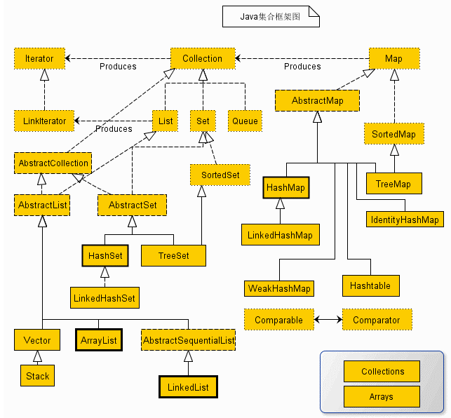
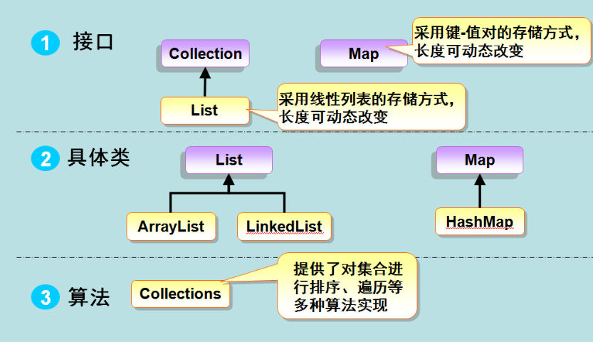

#### HashMap(jdk1.8)

hashmap 基于 数组 + 链表; 当元素个数超过阀值, 会由链表转为 TreeNode(红黑树)

**链表转树形, 当table 大于等于 64 并且 table中单个元素的链表结构长度达到8**

**在极端情况下: 当连续存储的元素的 hash 相同, 个数达到 11时, 也就是说 table 中只有一个元素, 但是链表长度达到 11, 此时链表也会转树形**;

#####关于碰撞

**hash(散列): 将任意长度的输入, 通过 hash 算法, 变成固定长度的输出. 通常输出的空间远小于输入的空间**

链地址法: HashMap 中, 使用的是**链地址法**,  就是每个节点都有一个 next 指针, 用来保存相同 hash 值不等 equals 方法的 元素

**开放地址**: 开放定址法就是一旦发生了冲突，就去寻找下一个空的散列地址，只要散列表足够大，空的散列地址总能找到，并将记录存入. 用开放定址法解决冲突的做法是：当冲突发生时，使用某种探测技术在散列表中形成一个探测序列。沿此序列逐个单元地查找，直到找到给定的关键字，或者碰到一个开放的地址（即该地址单元为空）为止（若要插入，在探查到开放的地址，则可将待插入的新结点存人该地址单元）。查找时探测到开放的地址则表明表中无待查的关键字，即查找失败

公式为：fi(key) = (f(key)+di) MOD m (di=1,2,3,……,m-1) 

​		比如说，我们的关键字集合为{12,67,56,16,25,37,22,29,15,47,48,34},表长为12. f(key) = key mod 12

**在 hash**: 有多个不同 Hash 函数, 当发生冲突时, 使用不同 hash 函数进行计算知道无法冲突. 增加了计算时间

HashMap 底层实现为 Entry<K, V> 数组 + Node 链表 + TreeNode 红黑树, 在执行Put 方法时, 先计算 K 的Hash 值, 找到对应数组所在的下标保存, 因为存取的元素会有 hash 相同的情况, 这个种情况叫做**碰撞**, **碰撞**发生时, 会再比较 K 之间的 equals 方法来进行区分是否相同, 相同则替换value并返回value, 不相同, 则在将后添加的元素保存在上一个元素的 next 节点. 关于扩容请看源码 ↓↓↓↓↓↓↓↓


```java
// 极端情况测试使用数据
private static final String STR = "Lq9BH,MR8aH,MQXAg,MQXBH,MR9Ag,N1wAg,N1wBH,N2WaH,LpXBH,N38aH,N39BH,N39Ag,N2XBH,LowAg,LpXAg,LpWaH,LowBH,Lq9Ag,MPwAg,MPvaH,MPwBH";
```

**put()**

```java
	static final int hash(Object key) {
        int h;
      	// HashMap 可以添加 null 键值对, null,永远在 table 数组第一元素位
        return (key == null) ? 0 : (h = key.hashCode()) ^ (h >>> 16);
    }

	public V put(K key, V value) {
  		return putVal(hash(key), key, value, false, true);
	}

	// 1. 寻找 bucket, hash 碰撞
	// 2. 扩容
	final V putVal(int hash, K key, V value, boolean onlyIfAbsent,
                   boolean evict) {
        Node<K,V>[] tab; Node<K,V> p; int n, i;
        if ((tab = table) == null || (n = tab.length) == 0)
          	//① 第一次添加值, 初始化话table 数组大小
            n = (tab = resize()).length;
        if ((p = tab[i = (n - 1) & hash]) == null)
          	
            tab[i] = newNode(hash, key, value, null);
        else {
            Node<K,V> e; K k;
          	// 插入相同 key 时, 不会对table 进行元素添加操作, 会将已经存在的 key 对应的 value 返回
            if (p.hash == hash && ((k = p.key) == key || (key != null && key.equals(k))))
                e = p;
            else if (p instanceof TreeNode)
              	// 当链表转红黑树后
                e = ((TreeNode<K,V>)p).putTreeVal(this, tab, hash, key, value);
            else {
                for (int binCount = 0; ; ++binCount) {
                  	// 此处循环同一节点下各个链表中的元素
                    if ((e = p.next) == null) {
                        p.next = newNode(hash, key, value, null);
                      	// 当链表中的元素达到 8 个时, 链表会向树形转换, 也就是table当前槽位的链表
                        if (binCount >= TREEIFY_THRESHOLD - 1) // -1 for 1st
                            treeifyBin(tab, hash);
                        break;
                    }
                  	// 当链表中元素个数小于 8, 当遍历到最后一个元素循环终止
                    if (e.hash == hash &&
                        ((k = e.key) == key || (key != null && key.equals(k))))
                        break;
                    p = e;
                }
            }
            if (e != null) { // existing mapping for key
                V oldValue = e.value;
                if (!onlyIfAbsent || oldValue == null)
                    e.value = value;
                afterNodeAccess(e);
                return oldValue;
            }
        }
        ++modCount;
      	// 当元素个数超过扩容阀值, 进行扩容
        if (++size > threshold)
            resize();
        afterNodeInsertion(evict);
      	// 说明本次插入的 key 为首次插入, 对应的 value 在 map 中为 null; 说明插入成功
        return null;
    }
	// 链表转树形
	final void treeifyBin(Node<K,V>[] tab, int hash) {
        int n, index; Node<K,V> e;
      	// 在链表转树形时, 需要table大小为64, 数组中至少有一个链表的大小为 8, 否则对 table 数组扩容
      	// 在极端请款下, table 数组的元素的 hash 都相等且个数为 11 时, 此时table大小为64, 链表也会转为树形
        if (tab == null || (n = tab.length) < MIN_TREEIFY_CAPACITY)
            resize();
      	// tab[index = (n - 1) & hash] 第一个元素, 后面插入的元素都是上一个元素的 next 节点
        else if ((e = tab[index = (n - 1) & hash]) != null) {
            TreeNode<K,V> hd = null, tl = null;
            do {
              	// 根据第一个插入并瞒足转树形条件的元素新建 TreeNode, 并将链表转为树形
                TreeNode<K,V> p = replacementTreeNode(e, null);
                if (tl == null)
                    hd = p;
                else {
                    p.prev = tl;
                    tl.next = p;
                }
                tl = p;
            } while ((e = e.next) != null);
            if ((tab[index] = hd) != null)
                hd.treeify(tab);
        }
    }
	////////////////////putTreeVal
	final TreeNode<K,V> putTreeVal(HashMap<K,V> map, Node<K,V>[] tab,
                                       int h, K k, V v) {
            Class<?> kc = null;
            boolean searched = false;
            TreeNode<K,V> root = (parent != null) ? root() : this;
            for (TreeNode<K,V> p = root;;) {
                int dir, ph; K pk;
                if ((ph = p.hash) > h)
                    dir = -1;
                else if (ph < h)
                    dir = 1;
              	// hash 碰撞, 其实就是 hash 值相同的多个元素; java 中用链表的方式解决, 最终通过 equals 方法来区分不同的 key, 相对于 jdk 1.7, 在极端情况下,1000个元素 jdk1.7 可能需要比较1000次, jdk1.8 最多只需要比较500次(红黑树, 一半)
                else if ((pk = p.key) == k || (k != null && k.equals(pk)))
                    return p;
                else if ((kc == null &&
                          (kc = comparableClassFor(k)) == null) ||
                         (dir = compareComparables(kc, k, pk)) == 0) {
                    if (!searched) {
                        TreeNode<K,V> q, ch;
                        searched = true;
                        if (((ch = p.left) != null &&
                             (q = ch.find(h, k, kc)) != null) ||
                            ((ch = p.right) != null &&
                             (q = ch.find(h, k, kc)) != null))
                            return q;
                    }
                    dir = tieBreakOrder(k, pk);
                }

                TreeNode<K,V> xp = p;
                if ((p = (dir <= 0) ? p.left : p.right) == null) {
                    Node<K,V> xpn = xp.next;
                    TreeNode<K,V> x = map.newTreeNode(h, k, v, xpn);
                    if (dir <= 0)
                        xp.left = x;
                    else
                        xp.right = x;
                    xp.next = x;
                    x.parent = x.prev = xp;
                    if (xpn != null)
                        ((TreeNode<K,V>)xpn).prev = x;
                    moveRootToFront(tab, balanceInsertion(root, x));
                    return null;
                }
            }
        }

```

**resize()**

```java
	// resize 方法可以分为两部分
	// 1. 第一次添加数据, 初始化 table 数组大小
	// 2. 扩容, 增长数组大小, 数据的复制
	final Node<K,V>[] resize() {
        Node<K,V>[] oldTab = table;
  		//① 原始数组大小, 第一次为 0.
        int oldCap = (oldTab == null) ? 0 : oldTab.length;
  		//① 扩容阀值 初始值 0
        int oldThr = threshold;
        int newCap, newThr = 0;
        if (oldCap > 0) {
            if (oldCap >= MAXIMUM_CAPACITY) {
                threshold = Integer.MAX_VALUE;
                return oldTab;
            }
            else if ((newCap = oldCap << 1) < MAXIMUM_CAPACITY &&
                     oldCap >= DEFAULT_INITIAL_CAPACITY)
              	// oldThr << n  === oldThr * 2ⁿ  oldThr >> n  === oldThr / 2ⁿ
              	// 每次数组和阀值增长都是 2 的倍数
                newThr = oldThr << 1; // double threshold
        }
        else if (oldThr > 0) // initial capacity was placed in threshold
            newCap = oldThr;
        else {               // zero initial threshold signifies using defaults
          	//① 第一次添加值, 初始化大小, 数组大小 16
            newCap = DEFAULT_INITIAL_CAPACITY;
          	//① 扩容阀值 12
            newThr = (int)(DEFAULT_LOAD_FACTOR * DEFAULT_INITIAL_CAPACITY);
        }
        if (newThr == 0) {
            float ft = (float)newCap * loadFactor;
            newThr = (newCap < MAXIMUM_CAPACITY && ft < (float)MAXIMUM_CAPACITY ?
                      (int)ft : Integer.MAX_VALUE);
        }
  		//① 扩容阀值 12 
        threshold = newThr;
        @SuppressWarnings({"rawtypes","unchecked"})
            Node<K,V>[] newTab = (Node<K,V>[])new Node[newCap];
  		//① table 初始化
        table = newTab;
        if (oldTab != null) {
            for (int j = 0; j < oldCap; ++j) {
                Node<K,V> e;
                if ((e = oldTab[j]) != null) {
                    oldTab[j] = null;
                    if (e.next == null)
                        newTab[e.hash & (newCap - 1)] = e;
                    else if (e instanceof TreeNode)
                        ((TreeNode<K,V>)e).split(this, newTab, j, oldCap);
                    else { // preserve order
                        Node<K,V> loHead = null, loTail = null;
                        Node<K,V> hiHead = null, hiTail = null;
                        Node<K,V> next;
                        do {
                            next = e.next;
                            if ((e.hash & oldCap) == 0) {
                                if (loTail == null)
                                    loHead = e;
                                else
                                    loTail.next = e;
                                loTail = e;
                            }
                            else {
                                if (hiTail == null)
                                    hiHead = e;
                                else
                                    hiTail.next = e;
                                hiTail = e;
                            }
                        } while ((e = next) != null);
                        if (loTail != null) {
                            loTail.next = null;
                            newTab[j] = loHead;
                        }
                        if (hiTail != null) {
                            hiTail.next = null;
                            newTab[j + oldCap] = hiHead;
                        }
                    }
                }
            }
        }
        return newTab;
    }
```

**get() 方法**

```java
	public V get(Object key) {
        Node<K,V> e;
        return (e = getNode(hash(key), key)) == null ? null : e.value;
    }
	// 判断 key 所在的槽位是单个 node, 链表 node, TreeNode, 然后再获取对应元素
	final Node<K,V> getNode(int hash, Object key) {
        Node<K,V>[] tab; Node<K,V> first, e; int n; K k;
      	// 根据 hash 值直接查找是否有该元素, 没有返回 null
        if ((tab = table) != null && (n = tab.length) > 0 &&
            (first = tab[(n - 1) & hash]) != null) {
          	// always check first node, 永远为链表的第一个元素
          	// key != null &&key.equals(k) 说明 table 中该元素不为链表或树的第一个元素
            if (first.hash == hash && ((k = first.key) == key || (key != null &&key.equals(k))))
                return first;
          	//当前元素为链表或树中大于一位的元素
            if ((e = first.next) != null) {
              	// 当为树时
                if (first instanceof TreeNode)
                    return ((TreeNode<K,V>)first).getTreeNode(hash, key);
              	// 当为链表时
                do {
                    if (e.hash == hash &&
                        ((k = e.key) == key || (key != null && key.equals(k))))
                        return e;
                } while ((e = e.next) != null);
            }
        }
        return null;
    }
```

**remove() 方法**

```java
public V remove(Object key) {
        Node<K,V> e;
        return (e = removeNode(hash(key), key, null, false, true)) == null ?
            null : e.value;
    }
final Node<K,V> removeNode(int hash, Object key, Object value,
                               boolean matchValue, boolean movable) {
        Node<K,V>[] tab; Node<K,V> p; int n, index;
  		// 前面这部分代码和 get() 方法一致, 首先先要判断元素是否存在, 然后获取对应元素
        if ((tab = table) != null && (n = tab.length) > 0 &&
            (p = tab[index = (n - 1) & hash]) != null) {
            Node<K,V> node = null, e; K k; V v;
            if (p.hash == hash &&
                ((k = p.key) == key || (key != null && key.equals(k))))
                node = p;
            else if ((e = p.next) != null) {
                if (p instanceof TreeNode)
                    node = ((TreeNode<K,V>)p).getTreeNode(hash, key);
                else {
                    do {
                        if (e.hash == hash &&
                            ((k = e.key) == key ||
                             (key != null && key.equals(k)))) {
                          	// node 当前元素
                            node = e;
                            break;
                        }
                      	// p 为移除元素的上一个元素, 
                      	// get()时 always check first node, 永远为链表的第一个元素. 的由来
                        p = e;
                      // e = e.next 获取到了当前元素
                    } while ((e = e.next) != null);
                }
            }
          	
            if (node != null && (!matchValue || (v = node.value) == value ||
                                 (value != null && value.equals(v)))) {
              	// 下面三个 if 判断元素类型
                if (node instanceof TreeNode)
                  	// 移除树中的元素, 根据hash 和 equals 方法
                    ((TreeNode<K,V>)node).removeTreeNode(this, tab, movable);
                else if (node == p)
                  	// 当为 table 数组元素, node 的 next 节点是没有元素的;
                    tab[index] = node.next;
                else
                  	// 当为链表结构. 使用移除元素的下一个元素替换当前元素, 做为当前元素的上一个元素的下个元素, 当前元素被移除
                    p.next = node.next;
                ++modCount;
                --size;
                afterNodeRemoval(node);
                return node;
            }
        }
        return null;
    }
```

