# Docker Command

## [docker 相关(docker hup docker 仓库)](https://hub.docker.com/r/couchbase/server/)

docker search name  搜索 docker 中 name 的镜像

docker pull name:tag tag表示版本,不加tag 默认下载latest版本

docker images 查看本地下载的镜像

docker rmi images_id 镜像id(映射后的容器对应的镜像无法通过此命令删除)

## docker 容器mysql

**mysql 配置文件路径 /etc/mysql/ 或者 /etc/my.cnf**

当mysql 容器修改 mysql.conf 配置后无法正常启动时

```shell
## 查看容器详细信息
docker inspect [mysql id]
 "MergedDir": "/var/lib/docker/overlay2/79a847916001bbef56c3be162a833c81c7e9c9f4144d5708060f10176ce11ea2/merged",
## 查找 MergedDir 对应的目录的上一级目录 diff, 如下就是修改过 mysql.cnf 文件
```

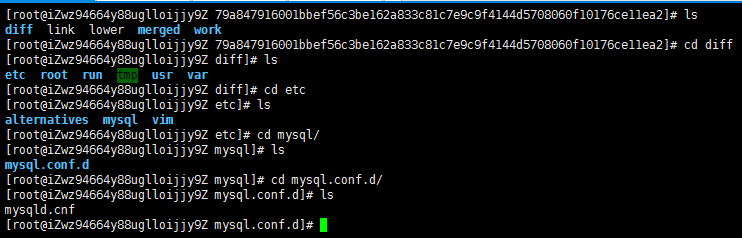


## 容器操作(tomcat 为例)

1. 搜索镜像 docker search tomcat
2. 拉取镜像 docker pull tomcat
3. 根据镜像启动容器

​    docker run --name container-name(自定义的名字) -d (后台运行)  iamge-name:tag(镜像名字:版本)

4. docker ps 查看运行中的容器
5. docker stop container-id(container-name)停止运行中的容器,通过容器id 或者 容器名字
6. docker ps -a 查看所有容器

启动 docker 中存在镜像容器

7. docker start container-name(id) 根据 container-name(id) 启动镜像容器

​    交互式启动一个容器: docker start -i container-name(id)

8. docker stop container-name(id) 根据 container-name(id) 停止镜像容器

​     docker kill container-name(id) 直接停止容器

9. docker rm container-name(id) 删除一个镜像容器(必须是停止状态)
10. docker run --name container-name -d -p 1111:8080 tomcat:latest  docker 映射镜像容器端口,方便外部访问 (-p表示映射端口, 1111 表示外部访问映射的端口,8080表示镜像容器运行的端口)
11. 启动mysql 容器 

 	docker run --name mysql01 -p 3306:3306-e MYSQL_ROOT_PASSWORD=123456 -d mysql

 	docker exec -it mysql01 /bin/bash 进入mysql01 容器

​     	**mysql -uroot -p 进入 mysql 命令窗口**

​	**redis-cli 进入命令行界面**

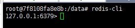

​	备份 docker 中 mysql

​	docker exec mysql01 sh -c ' exec mysqldump --all-databases[或者指定数据库--databases db1] -uroot -p 		"123456"' > [宿主机目录/all-databases.sql]

12. 启动容器

    交互式启动: docker run -it --name alias images-name 

    通过 exit 退出并关闭, ctrl + p +q 退出但不停止

    退出后进入容器的方法

    docker attach containername(id) 注: 不适应有后端输出的容器, 如: tomcat mysql

    docker exec -it containername(id) [dommand] 在终端对守护进程容器操作

    docker exec -it containername(id) [/bin/bash] 重新进入到守护进程容器

    守护进程方式(后台): docker run -d --name alias iamges-name

13. 批量删除镜像和容器

    docker rmi -f $(docker images -qa)

    docker rm -f $(docker ps -qa)

14. 查看容器详细信息

    docker inspect [container]

15. 从容器中复制文件到宿主机

    docker cp [container]:/root/yum.log [原主机目录]

16. 容器数据卷: 用作数据的持久化

    ① 通过命令的形式实现

    docker run -it -v /宿主机目录;/容器目录 imagesname

    ② 通过 dockerfile 实现

    自定义镜像 volume-from 继承

    dockerfile 文件中指定的数据备份目录

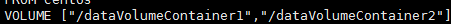

​	docker run -it --name alias [container1] --volume-from [container2][images]

​	[container1] 和 [container2] 都会有相同的目录并且目录中的数据会共享,知道容器不再使用

17 . 通过 dockerfile 自定义构建镜像

​	① [编写dockerfile 文件 参考](https://github.com/docker-	library/redis/blob/f1a8498333ae3ab340b5b39fbac1d7e1dc0d628c/5.0/Dockerfile)

​	 ② 执行命令 docker build -f [/path/dockerfile] -t [自定义 images:tag] . 

​	③ 运行

​		docker run -ti -v /sys/fs/cgroup:/sys/fs/cgroup:ro -p 80:80 container

18. dockerfile docker镜像的构建文件

    dockerfile (保留字指令)

    FORM : 基础镜像, 当前镜像基于那个镜像

    MAINTAINER: 镜像维护这的姓名和邮箱地址

    RUN: 容器运行时需要构建的命令

    EXPOSE: 是当前容器对外暴露的端口

    WORKDIR: 指定在创建容器后, 终端默认登陆进来的工作目录,(主要应用于交互式容器启动)默认在 / 目录

    ENV: 用来在构建镜像过程中设置环境变量 EVN KEY /usr WORKDIR $KEY 使用上面定义的变量

    ADD: 将宿主机目录下的文件拷贝进镜像且 ADD 指令会自动处理 URL 和解压 tar 压缩包

    COPY: 类似 ADD 但是不会解压

    VOLUME: 容器数据卷, 用于数据保存和持久化工作

    CMD: 指定一个容器启动时要运行的命令 dockerfile 中可以有多个 CMD 但是只有最后一个,生效, 并且会被 docker run 之后的参数替代

    ENTRYPOIBNT: 追加不会失效和替换

    ONBUILD: 触发器, 构建一个被继承的 dockerfile 时运行命令, 父镜像被子镜像继承后父镜像的 ONBUILD 会被	触发

    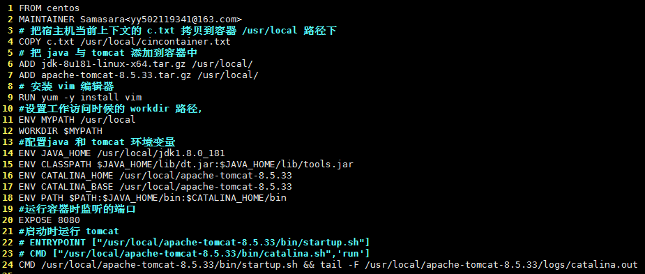

    [示例](https://www.cnblogs.com/guilty/p/4760301.html)

    -- privileged=true 如果没有写权限

    19. 将本地镜像 push 到云端

        ① commit 以已运行容器创建新镜像

        ​     docker commit -a [author] -m [commi message] [containername<id>] [new images:tag]

        ② 将新镜像推送到阿里云

        ​     需要在阿里云先创建命名空间和仓库

        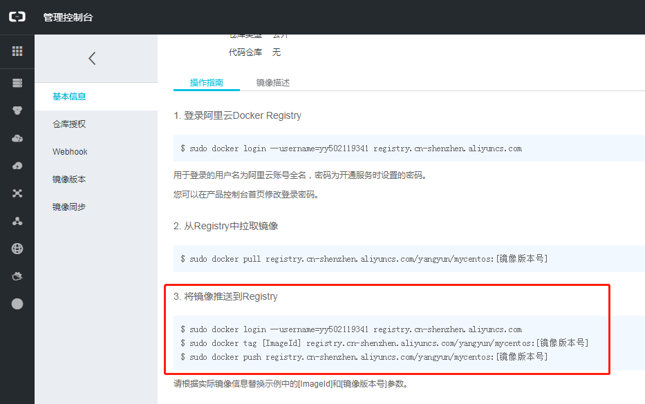

        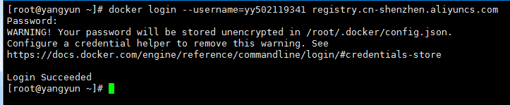

        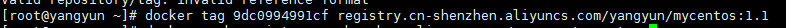

        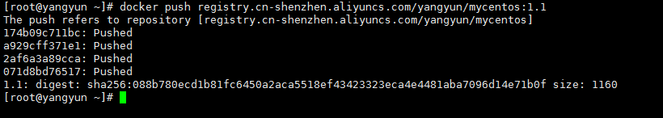

        ​

## 后台进入

​	**mysql -uroot -p 进入 mysql 命令窗口**

​	**redis-cli 进入命令行界面**

## 公共命令

​	cat /home/fiilename 查看指定目录下文件的内容

​	cd ~ 进入当前系统用户的目录

​	yum install mlocate centos 没有 updatedb 和 locate 命令

​	yum install -y unzip zip centos 没有 zip 和 unzip 命令

​	df -h 查看磁盘是使用情况

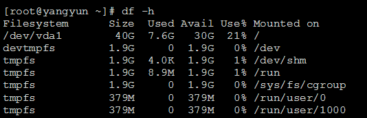

​	du -h [指定目录] 查看指定目录使用情况

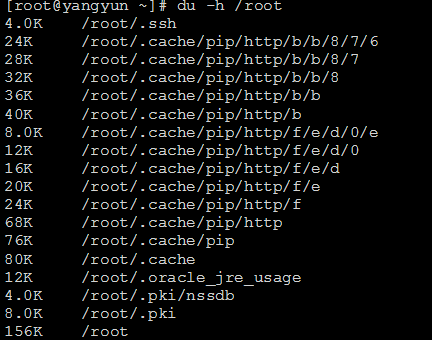

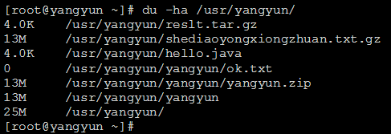

​	统计指定目录下文件的个数


​	统计指定目录下文件夹的个数

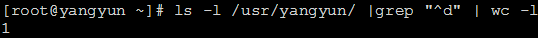

​	递归统计

​	ls -lR /opt | grep "^d" | wc -l

​	查看系统安装的软件包

​	rpm -qa | grep redis

#### 	docker install vim

​		apt-get update  apt-get install vim

