# Java 内存模型

#### volatile: java 虚拟机提供的轻量级的同步机制

1.1 保证可见性(可见性): 保证一个线程修改主内存中的共享变量后,其他线程能及时看到
 在主内存中有一份数据, example: age = 25, 有三个线程同时对 age 操作
 ① 将 age 拷贝到各自的工作内存中,进行修改, 然后将修改后的值赋值给主内存, 如果其中一个线程完成了这个操作, 
   需要通知其他线程主内存的值已经被修改, 其他的线程需要重新获取主内存中的值进行操作
1.2 不保证原子性(原子性)

​	原子性: 不可分割, 完整性, 某个线程在做某个具体操作时, 中间不可以被加塞或分割, 需要整体完整, 要么同时成功, 要么同时失败(保证数据的完整一致性), 在同一时刻某个具体操作只允许有一个线程进行操作

1.3 禁止指令重排(有序性)

​	计算机在执行程序时, 为了提高性能, 编译器和处理器常常会**对指令做重排**, 分为三种情况


​	单线程环境里面确保程序最终执行结果和代码顺序执行的结果一致;

​	处理器在进行重排序时必须考虑指令之间的**数据依赖性**;

​	多线程环境中线程交替执行, 由于编译器优化重排的存在, 两个线程中使用的变量能否保证一致性是无法确定的, 结果无法预测

1.4 volatile + DCL(DCL Double check lock 双端检索机制) 实现多线程环境下单列模式

```java
public static SingletonDemo getInstance (){
        // DCL Double Check Lock
        if (instance == null){
            synchronized (SingletonDemo.class) {
                if (instance == null){
                    instance = new SingletonDemo();
                }
            }
        }
        return instance;
    }
```

​	在多线程环境下 DCL 机制不一定线程安全, 原因是有指令重排的存在;

​	instance = new Singleton();(由三个指令完成

​	① memory = allocate(); 分配内存空间

​	② instance(memory) 初始化对象

​	③ instance = memory 设置 instance 指向分配的内存地址	

​	由于 ② ③ 不存在数据依赖性, 又由于指令重排的存在, 在多线程的环境下

​	instance = new Singleton(); 重排指令后执行顺序为 ①->③->②

```java
public static SingletonDemo getInstance (){
        // DCL Double Check Lock
        if (instance == null){
            synchronized (SingletonDemo.class) {
                if (instance == null){
                    instance = new SingletonDemo();
                }
            }
        }
        return instance;
    }
多线程环境下: 线程1, 线程2 同时调用 geteInstance() 方法
线程1 执行到 instance = new SingletonDemo();由于指令重排的存在
① memory = allocate(); 分配内存空间
③ instance = memory 设置 instance 指向分配的内存地址
线程1 执行完① 和 ③ 的指令
线程2 执行到 if (instance == null) 这行代码, 此时 instance 指向了分配好的内存空间,instance 不为 null 线程2 直接返回,由于②instance(memory) 没有进行初始化, 但instance = memory 指向的内存空间里面实际是没有值;所以会造成线程安全
```

​	

#### JMM(Java memory model) Java内存模型: 描述的是一组规则和规范, 定义了程序中各个变量(实例字段, 静态字段, 构成数组对象的元素)的访问方式

 实例字段, 静态字段, 构成数组对象的元素称之为共享变量
  主内存(物理内存, 内存条), 共享区域内存, 对所有线程共享
  工作内存, 线程对变量的操作必须在工作内存中完成
JMM 关于同步的规定:

三大特性
  	 可见性
  	 原子性
  	 有序性

  ① 线程解锁前必须把共享变量的值刷回主内存

#### CAS

1: compare and set 比较并交换;

​    

```java
AtomicInteger atomicInteger = new AtomicInteger(5);
初始值为 5, compareAndSet(6, 1016): 如果初始值为 6 就将初始值变更为 1016, 否则不变
boolean b = atomicInteger.compareAndSet(6, 1016); 返回false
```

原理: 自旋锁 和 unsafe

① atomicInteger.getAndIncrement() 为什么能保证原子性

```java
AtomicInteger class	
	// 保证了可见性
	private volatile int value;
	// 带初始值构造方法
	public AtomicInteger(int initialValue) {
        value = initialValue;
    }	
	/**
     * Atomically increments by one the current value.
     *
     * @return the previous value
     */
    public final int getAndIncrement() {
      	// this 当前对象, valueOffset 偏移量, 当前对象内存地址, 1 每次调用之后, 在原始值的基础上加 1
        return unsafe.getAndAddInt(this, valueOffset, 1);
    }
Unsafe class{
  public final int getAndAddInt(Object var1, long var2, int var4) {
        int var5;
        do {
          	// 获取当前对象 var1 内存地址为 var2 对象的值
            var5 = this.getIntVolatile(var1, var2);
          	// this.compareAndSwapInt(var1, var2, var5, var5 + var4)
          	// 获取 var5 后, 比较内存中的值是否一致, 如果一致, 就替换, 并返回获取的 var5
          	// 如果不一致, 重新获取比较, 获取的值和内存中的值一致
        } while(!this.compareAndSwapInt(var1, var2, var5, var5 + var4));

        return var5;
    }
}
```

Unsafe (sun.misc)

​	是 CAS 的核心类, 由于 java 方法无法直接访问底层系统, 需要通过本地方法(native) 来访问, Unsafe 相当于一个后门. 基于该类可以操作特定内存中的数据. 其内部方法可以像 C 的指针一样直接操作内存

​	CAS Compare-And-Set 它是一条 CPU 并发原语

​	它的功能是判断内存某个位置的值是否为预期值, 如果是则替换为新值, 这个过程是原子性的

​	CAS 并发原语体现在 Unsafe 类中的各个方法(native 修饰), 这是一种完全依赖于硬件的功能, 通过它实现原子操作. CAS 是一种系统原语, 由若干条制定组成, 用于完成某个功能的一个过程. 并且原语在执行时必须保证时连续的, 在执行过程中不允许被中断,, 也就是说 CAS 是一条 CPU 原子指令. 不会造成数据不一致的问题

2. CAS 缺点

   ① do while 循环时间长, 导致 cpu 开销大

   ② 只能保证一个共享变量的原子操作

   ③ 引出来 ABA问题

   ABA 问题: CAS 算法实现的一个重要前提需要取出内存中某一时刻的数据并在当下时间比较并替换, 在这个时间差内会导致数据变化(只管结果,不管过程)

   A, B 两线程; 主内存中原始值为 10, A 线程每次执行只需要 2 秒, B 线程每次执行需要 10 秒, 第一次 A 线程将主内存中值修改为 12, 第二次又将值修改为 10, 然后 B 线程获取主内存中值为 10, 然后修改; 在B 线程操作前, 主内存中的值已经被 A 线程修改过一次了. 在多线程高并发情况下, 在 B线程操作这个共享变量前的这个时间差内, 数据是变化的;

   AtomicReference, AtomicStampedReference 原子引用类, 通过 AtomicStampedReference 解决 CAS ABA 问题
#### 集合类不安全问题

1 产生原因; java.util.ConcurrentModificationException 并发修改异常

​	ArrayList 线程不安全的; 在多线程环境下, 一个线程在进行写操作时, 另一个线程进行读操作, 造成数据不一致

2 解决方法

​	使用 Vector , Vector.add() 使用了synchronize ,解决安全问题, 降低了并发性

​	Collections.synchronizeList(new ArrayList()); 

​	new  CopyOnWriteArrayList(); 写时复制, 读写分离的思想, 读和写为不同容器

```java
List<T> list = new CopyOnWriteArrayList<>();

public class CopyOnWriteArrayList {
	private transient volatile Object[] array;

	public CopyOnWriteArrayList() {
        setArray(new Object[0]);
    }

	public boolean add(E e) {
      	// 获取锁
        final ReentrantLock lock = this.lock;
      	// 加锁
        lock.lock();
        try {
          	// 获取原对象
            Object[] elements = getArray();
            int len = elements.length;
          	// 复制新对象, 并长度加 1
            Object[] newElements = Arrays.copyOf(elements, len + 1);
          	// 添加新元素
            newElements[len] = e;
          	// 将原对象引用指向新集合对象
            setArray(newElements);
            return true;
        } finally {
          	// 释放锁
            lock.unlock();
        }
    }

	// 将原对象引用指向新集合对象
	final void setArray(Object[] a) {
        array = a;
    }

	final Object[] getArray() {
        return array;
    }
}
```

#### 值传递和引用传递

八种基本数据类型都存在于栈中, 方法间相互调用, 基本类型传递为值传递, 不会改变原来的值;

引用类型在方法之间调用传递为引用传递, 对象中属性值的改变会影响到原来的对象;

String 存在于常量池中

```java
		String str1 = "abc"; // 这种直接赋值, 会先判断常量池中是否存在 abc, 存在复用, 不存在新建
		String str2 = new String("abc"); // 这种 new 的方式, 属于新建一个对象, 存在于堆中
		System.out.println(str1 == str2);// 比较的是内存地址
		String str3 = new String("abc");
		System.out.println(str3 == str2); // 比较的是内存地址
		
```

#### java锁之公平和非公平锁

ReentrantLock(默认非公平锁): 可重入锁, 公平所, 非公平锁

######lock(公平锁)

```java
public class ReentrantLockDemo {
    try {
        // 公平锁
        ReentrantLock rl = new ReentrantLock(true);
        rl.lock();
     rl.lock();
        // 能够更请清楚看整个执行流程
		TimeUnit.SECONDS.sleep(60);
        new Thread(() -> {
          rl.lock();
        }, "aaa").start();
        TimeUnit.SECONDS.sleep(60);
        new Thread(() -> {
          rl.lock();
     }, "bbb").start();
    } catch (Exception e){
     e.printStackTrace();
    }	
}
```

~~~java
public class ReentrantLock implements Lock, java.io.Serializable { 
  	// 初始化
	public ReentrantLock(boolean fair) {
        sync = fair ? new FairSync() : new NonfairSync();
    }
  
  	// 将 Sync 和 AbstractQueuedSynchronizer 的代码合并了一起说明
  	static final class FairSync extends Sync extends AbstractQueuedSynchronizer {
      	// 重入次数
      	private volatile int state;
      	// 当前节点超时或者终端, 该节点被取消, 节点永远不会改变状态, 并且取消该节点的线程永远不会再次阻塞
      	static final int CANCELLED =  1;
      	// 等待状态值, 后续线程需要暂停
      	static final int SIGNAL = -1;
      	// 表示线程处于等待状态, 当前线程处于条件队列行 Condition
      	static final int CONDITION = -2;
      	// 表示下一个对象的默认状态值应该无条件传递下去
      	static final int PROPAGATE = -3;
      	// 初始化, 用来做线程获取锁的判断
      	private static final Unsafe unsafe = Unsafe.getUnsafe();
     	// 
      	final void lock() {
            acquire(1);
        }
      	public final void acquire(int arg) {
          	// !tryAcquire(arg) 第一次进来, 为true 
          	// 当之前任务没有完成, 后面又有任务来获取锁, 
          	// acquireQueued(addWaiter(Node.EXCLUSIVE), arg)) 添加到队列中
        	if (!tryAcquire(arg) && acquireQueued(addWaiter(Node.EXCLUSIVE), arg))
            	selfInterrupt();
    	}
      	// 尝试获取锁
      	protected final boolean tryAcquire(int acquires) {
            final Thread current = Thread.currentThread();
          	// 第一次默认值为 0
            int c = getState();
            if (c == 0) {
              	// 第一个任务, hasQueuedPredecessors() 返回false
              	// compareAndSetState(0, acquires)) 成功获取锁, 并改变 state 值为 1
                if (!hasQueuedPredecessors() &&
                    compareAndSetState(0, acquires)) {
                    setExclusiveOwnerThread(current);
                    // 表示获取到了锁
                    return true;
                }
            }
          	// 当希望获取锁的任务为同一个时(在 unlock() 未执行), 也可以获取锁(可重入)
            else if (current == getExclusiveOwnerThread()) {
              	// 记录被重入的次数
                int nextc = c + acquires;
                if (nextc < 0)
                    throw new Error("Maximum lock count exceeded");
                setState(nextc);
             return true;
            }
         // 没有获取锁, 需要将当前任务添加到等待队列中
            return false;
        }
        // 将等待任务添加到 AQS 队列
        private Node addWaiter(Node mode) {// mode 为当前来获取锁的线程
            Node node = new Node(Thread.currentThread(), mode);
            // Try the fast path of enq; backup to full enq on failure
            Node pred = tail;
            if (pred != null) {
                node.prev = pred;
                // 设置尾部的元素, 将当前来获取锁的线程添加到队尾
                if (compareAndSetTail(pred, node)) {
                  	// 上个元素的 next 指向当前获取锁的线程
                    pred.next = node;
                    return node;
                }
            }
          	// 在锁被占用, 后面第一个线程进入, 初始化 node
            enq(node);
            return node;
    	}
        // 初始化 queue 中第一个 node
      	// Node t = tail; tail = head; node.prev = t; t.next = node; 循环指引
        private Node enq(final Node node) {
            for (;;) {
                Node t = tail;
                if (t == null) { // Must initialize
                  	// 初始化头节点, node 的 next 才是真正指向当前来获取的线程,
                  	// 而 waitStatus 记录的也是 next 的状态值
                  	// 在 unlock 中可以发现, 每次唤醒的都是 node 的 next,而且 waitStatus 却是更具当前node 的 waitStatus 来判断
                    if (compareAndSetHead(new Node()))
                      	// head = new Node();
                        tail = head;
                } else {
                    // 实际添加元素, node 记录的为当前线程
                    node.prev = t;
                  	// 第二个获取锁的线程在队列中, 既是头节点也是尾节点(在后面线程添加进入队列时, 由于循环引用)
                    if (compareAndSetTail(t, node)) {
                        t.next = node;
                        return t;
                    }
                }
            }
        }
      	// 入队列, 并将当前线程的 prev 的状态修改为 SIGNAL
        final boolean acquireQueued(final Node node, int arg) {
            boolean failed = true;// 标记是否获取锁
            try {
              	// 标记线程是否被中断过
                boolean interrupted = false;
              	// 从队尾开始往前, 尝试去获取锁
                for (;;) {
                  	// 当前节点的前置节点
                    final Node p = node.predecessor();
                    if (p == head && tryAcquire(arg)) {
                        setHead(node);
                        p.next = null; // help GC
                        failed = false;
                        return interrupted;
                    }
                    if (shouldParkAfterFailedAcquire(p, node) &&
                        // 检查当前线程是否中断过
                        parkAndCheckInterrupt())
                        interrupted = true;
                }
            } finally {
                if (failed)
                    cancelAcquire(node);
            }
      	}
      	// 返回前个节点
      	final Node predecessor() throws NullPointerException {
            Node p = prev;
            if (p == null)
                throw new NullPointerException();
            else
                return p;
        }
      	
      	// 判断当前节点获取锁失败后是否需要挂起
      	// node 当前线程, pred 当前线程的前置节点
        private static boolean shouldParkAfterFailedAcquire(Node pred, Node node) {
          	// 当前置节点状态和当前线程状态一致时(等待), 当前线程需要挂起
            int ws = pred.waitStatus;
            if (ws == Node.SIGNAL)
                
                return true;
            if (ws > 0) {
                // 如果前置节点为 cancel 时
                do {
                  	// 从队尾遍历, 寻找第一个不为 cancel 的线程作为当前线程的新的前置节点
                    node.prev = pred = pred.prev;
                } while (pred.waitStatus > 0);
                pred.next = node;
            } else {
                // waitStatus must be 0 or PROPAGATE.
              	// 当前节点的前置节点的状态的改变
                compareAndSetWaitStatus(pred, ws, Node.SIGNAL);
            }
            return false;
      	}
      	// 取消正在进行的尝试获取
        private void cancelAcquire(Node node) {
            // Ignore if node doesn't exist
            if (node == null)
                return;

            node.thread = null;

            // Skip cancelled predecessors
            Node pred = node.prev;
          	// 重新指向新的前置节点
            while (pred.waitStatus > 0)
                node.prev = pred = pred.prev;

            Node predNext = pred.next;

            node.waitStatus = Node.CANCELLED;

            // If we are the tail, remove ourselves.
          	// 如果当前线程为尾部节点, 则 next 为null
            if (node == tail && compareAndSetTail(node, pred)) {
                compareAndSetNext(pred, predNext, null);
            } else {
                // If successor needs signal, try to set pred's next-link
                // so it will get one. Otherwise wake it up to propagate.
                int ws;
              	// 如果不为头部节点, 并且状态为 signal, 设置前置节点状态为 signal
                if (pred != head &&
                    ((ws = pred.waitStatus) == Node.SIGNAL ||
                     (ws <= 0 && compareAndSetWaitStatus(pred, ws, Node.SIGNAL))) &&
                    pred.thread != null) {
                    Node next = node.next;
                    if (next != null && next.waitStatus <= 0)
                        compareAndSetNext(pred, predNext, next);
                } else {
                    unparkSuccessor(node);
                }

                node.next = node; // help GC
            }
      	}
    }
}
~~~

###### lock(非公平锁)

非公平锁流程: 

① compareAndSetState(0, 1) 判断是否可以获取锁, 成功获取锁, 并设置为独占锁, 

② 如果失败, 会再次尝试去获取锁, 在再次获取锁的过程中, 如果前面线程释放了锁, 这会导致前面排队的线程继续排队, 而后到线程却获取到了锁(**非公平**). 

③ 如果失败,则进入等待队列

```java
public class ReentrantLockDemo {
    try {
        // 公平锁
        ReentrantLock rl = new ReentrantLock(false);
        rl.lock();
     	rl.lock();
        // 能够更请清楚看整个执行流程
		TimeUnit.SECONDS.sleep(60);
        new Thread(() -> {
          rl.lock();
        }, "aaa").start();
        TimeUnit.SECONDS.sleep(60);
        new Thread(() -> {
          rl.lock();
     }, "bbb").start();
    } catch (Exception e){
     e.printStackTrace();
    }	
}
```

```java
 static final class NonfairSync extends Sync extends AbstractQueuedSynchronizer {
   	final void lock() {
      	// 非公平锁, 直接去获取锁
      	if (compareAndSetState(0, 1))
        	setExclusiveOwnerThread(Thread.currentThread());
      	else
          	// 失败, 添加到队列, 
          	// 再次尝试去获取锁, “非公平”即体现在这里，如果占用锁的线程刚释放锁，state置为0，而排队等待锁的线程还未唤醒时，新来的线程就直接抢占了该锁，那么就“插队”了
          	//后面逻辑和公平锁一致
        	acquire(1);
    }
 }
```

###### unlock

```java
   	public static void main(String[] args) {  
    	ReentrantLock rl = new ReentrantLock(true);
        rl.lock();
        rl.lock();
        TimeUnit.SECONDS.sleep(20);
        new Thread(() -> {
          rl.lock();
          System.out.println(Thread.currentThread().getName());
        }, "aaa").start();
        TimeUnit.SECONDS.sleep(5);
        rl.unlock();
    }
```

```java
    public void unlock() {
        sync.release(1);
    }
	
	// 是否成功释放锁
    public final boolean release(int arg) {
        if (tryRelease(arg)) {
            Node h = head;
            if (h != null && h.waitStatus != 0)
                unparkSuccessor(h);
            return true;
        }
        return false;
    }

    protected final boolean tryRelease(int releases) {
      	// getState 获取被重入次数
        int c = getState() - releases;
        if (Thread.currentThread() != getExclusiveOwnerThread())
          throw new IllegalMonitorStateException();
        boolean free = false;
        if (c == 0) {
          free = true;
          // 成功, 清空独占线程
          setExclusiveOwnerThread(null);
        }
		// 更新值
        setState(c);
        return free;
    }

	private void unparkSuccessor(Node node) {
        int ws = node.waitStatus;
        if (ws < 0)
            compareAndSetWaitStatus(node, ws, 0);
		// 释放的 next 节点, 前面 lock 有说明为啥是 next
        Node s = node.next;
        if (s == null || s.waitStatus > 0) {
            s = null;
            for (Node t = tail; t != null && t != node; t = t.prev)
                if (t.waitStatus <= 0)
                    s = t;
        }
        if (s != null)
          	// 唤醒
            LockSupport.unpark(s.thread);
    }
```

######可重入锁(递归锁)

可重入锁(递归锁): 同一线程外层函数获得锁之后, 内层递归函数仍然能获得该锁的代码, 在同一线程在外层方法获得锁的时候, 再进入内层方法会自动获得锁; 也就是说线程可以进入任何一个它已经获得锁所同步的代码块

```java
public void sync method01 (){
  	// 同一线程获得方法 method01 的锁, 将自动获得 method02 方法的锁
method02();
}
public void sync method02 (){
  
}
```
```java
   
   公平锁: 指多个线程按照申请锁的顺序获取锁; **保证有序性**
   
   非公平锁: 指多个线程获取锁的顺序不是固定的, 有可能后申请的线程先获取锁, 在高并发情况下, 有可能造成反转和饥饿现象(有可能先申请的线程一直获取不到锁), 当后申请的线程失败后会采用类似公平锁的方式; **增加吞吐量**
   
   synchronize 一种非公平锁

   #####自旋锁(spinlock)
   
   指尝试获取锁的线程不会立即阻塞, 而是通过循环的方式去尝试获取锁, 这样的好处是减少线程上下文的消耗, 缺点是会消耗 CPU; 因为循环会消耗 CPU	应用在程序处理快速的地方

   ```java
package com.yangyun.study.thread;
   
   import java.util.concurrent.atomic.AtomicReference;

   /**
    * @author yangyun
    * @create 2019-06-22-11:22
    */
   public class SpinLockDemo {
    AtomicReference<Thread> atomicReference = new AtomicReference<>();
   
       public void myLock (){
        Thread thread = Thread.currentThread();
           System.out.println(thread.getName() + "\t come in");
   
           while (!atomicReference.compareAndSet(null, thread)){
   
           }
       }
   
       public void myUnLock (){
           Thread thread = Thread.currentThread();
           System.out.println(thread.getName() + "\t invoked");
           atomicReference.compareAndSet(thread, null);
    }
   
    public static void main(String[] args) throws InterruptedException {
           SpinLockDemo spinLockDemo = new SpinLockDemo();
   
        new Thread(() -> {
               spinLockDemo.myLock();
               // 业务代码处理
               try {
                   Thread.sleep(5000);
            } catch (InterruptedException e) {
                   e.printStackTrace();
               }
               // 释放锁
               spinLockDemo.myUnLock();
           }, "AA").start();
   
           Thread.sleep(1000);
   
           new Thread(() -> {
               spinLockDemo.myLock();
   
               spinLockDemo.myUnLock();
           }, "BB").start();
       }
   }
   
```

##### 读写锁(ReentrantReadWriteLock 其读锁是共享锁, 写锁是独占锁)

ReentrantLock synchronized 为独占锁

独占锁(写锁): 同一时刻只能有一个线程操作资源类, **保证高效的并发性**

共享锁(读锁): 同意时刻可以有多个线程同时操作资源类

互斥锁(读写, 写读, 写写 互斥)

test

```java
	public static void main(String[] args) throws InterruptedException {
        try {
            ReentrantReadWriteLock lock = new ReentrantReadWriteLock(true);
            ReentrantReadWriteLock.WriteLock writeLock = lock.writeLock();
            ReentrantReadWriteLock.ReadLock readLock = lock.readLock();
          	// 当该锁被另一个写锁持有, 那么获取失败, 后面的线程都会进入到等待队列中
            writeLock.lock();
            TimeUnit.SECONDS.sleep(15);
            readLock.lock(); 
            TimeUnit.SECONDS.sleep(100);
            new Thread(() -> {
				// 这里这里再去获取锁失败
                readLock.lock();
            }, "AAA").start();

            TimeUnit.SECONDS.sleep(40);
            new Thread(() -> {
                readLock.lock();
            }, "BBB").start();

            TimeUnit.SECONDS.sleep(80);
            new Thread(() -> {
                readLock.lock();
            }, "CCC").start();
        } catch (Exception e){

        }
	}
```


```java
// 读写锁
public class ReentrantReadWriteLock implements ReadWriteLock, java.io.Serializable {
  	// 默认使用非公平锁, 可通过传入true 或 false 来使用公平或非公平锁
	ReentrantReadWriteLock lock = new ReentrantReadWriteLock(fair); 
  	
  	private final ReentrantReadWriteLock.ReadLock readerLock;
  	private final ReentrantReadWriteLock.WriteLock writerLock;
  
    public ReentrantReadWriteLock(boolean fair) {
        sync = fair ? new FairSync() : new NonfairSync();
        readerLock = new ReadLock(this);
        writerLock = new WriteLock(this);
    }
  
  	// 写锁, 为独占锁, 一次只有一个线程能操作资源类, 
  	public static class WriteLock implements Lock, java.io.Serializable {
      	private final Sync sync;
      
      	protected WriteLock(ReentrantReadWriteLock lock) {
            sync = lock.sync;
        }
      
      	public void lock() {
          	// 根据 ReentrantReadWriteLock(fair) 初始化, fair 来判断使用公平或非公平锁
          	// acquire(1) 间接调用的就是 ReentrantLock 的 acquire 方法
            sync.acquire(1);
        }
    }
  
  	// 读锁
  	public static class ReadLock implements Lock, java.io.Serializable {
      	private final Sync sync;
      
      	protected ReadLock(ReentrantReadWriteLock lock) {
            sync = lock.sync;
        }
      
      	public void lock() {
          	// 公平锁调用
            sync.acquireShared(1);
        }
    }
  	
  	public final void acquireShared(int arg) {
      	// readlock 调用, 尝试获取锁
        if (tryAcquireShared(arg) < 0)
            doAcquireShared(arg);
    }
  	
  	
  	protected final int tryAcquireShared(int unused) {
    	Thread current = Thread.currentThread();
        int c = getState();
      	// 1. 当该锁被另一个写锁持有, 那么获取失败
        if (exclusiveCount(c) != 0 &&
            getExclusiveOwnerThread() != current)
          return -1;
        int r = sharedCount(c);
        if (!readerShouldBlock() &&
            r < MAX_COUNT && // 65535
            compareAndSetState(c, c + SHARED_UNIT)) {
          if (r == 0) {
            firstReader = current;
            firstReaderHoldCount = 1;
          } else if (firstReader == current) {
            firstReaderHoldCount++;
          } else {
            HoldCounter rh = cachedHoldCounter;
            if (rh == null || rh.tid != getThreadId(current))
              cachedHoldCounter = rh = readHolds.get();
            else if (rh.count == 0)
              readHolds.set(rh);
            rh.count++;
          }
          return 1;
        }
        return fullTryAcquireShared(current); 
    }
  
  	// 已共享不中断的方式执行
    private void doAcquireShared(int arg) {
      	// 添加线程到排队队列, 代码和公平非公平锁一致, 都会将后面进来的线程指向上个 node 的 next
      	// 初始化 node waitStatus 都为 0
      	// 对于第一次进入队列的线程会初始化一个 waitStatus 为 0 空的node, 而它的next 会指向第一个进入的线程, 后面每次新来一个成员,都会添加到上个node 的next并且 waitStatus 都为 0
        final Node node = addWaiter(Node.SHARED);
        boolean failed = true;
        try {
          boolean interrupted = false;
          for (;;) {
            final Node p = node.predecessor();
            if (p == head) {
              // 因为程序运行了一段时间, 前面获取锁的线程的状态会发生改变
              int r = tryAcquireShared(arg);
              if (r >= 0) {
                // 当写锁执行完释放锁, 后面的读锁可以开始执行
                // 释放 node, 将所有node节点置为null
                setHeadAndPropagate(node, r);
                p.next = null; // help GC
                if (interrupted)
                  selfInterrupt();
                failed = false;
                return;
              }
            }	
            
            // p 为当前 node 的 pred node, node 为当前线程所在的node
           	// shouldParkAfterFailedAcquire 检查和更新当前线程的 pred 状态值, 因为waitStatus初始化都为 0, 第一次 shouldParkAfterFailedAcquire 为 false, 但是在 shouldParkAfterFailedAcquire 方法里面的 waitStatus 的值已经被更新为 SIGNAL (-1), 所以第二次循环到来, 执行 parkAndCheckInterrupt 将当前线程挂起
            if (shouldParkAfterFailedAcquire(p, node) &&
                parkAndCheckInterrupt())
              interrupted = true;
          }
        } finally {
          if (failed)
            cancelAcquire(node);
        }
    }
  	private void setHeadAndPropagate(Node node, int propagate) {
        Node h = head; // Record old head for check below
        setHead(node);
      	if (propagate > 0 || h == null || h.waitStatus < 0 ||
            (h = head) == null || h.waitStatus < 0) {
            Node s = node.next;
            if (s == null || s.isShared())
                doReleaseShared();
        }
    }
}
```


##### 阻塞队列

BlockQueue: 不需要关心线程的阻塞和唤醒


线程1 往队列中存元素, 线程2 从队列中取元素;

当队列中满元素时, 线程1 **生产**元素将被阻塞, 等待队列中元素减少

当队列中没有元素时, 线程2 **获取**元素将被阻塞直到队列中有新元素


###### ArrayBlockingQueue

固定容量, 默认 FIFO

```java
// capacity 容量, fair 访问方式 true: FIFO false: 无序  c: 初始集合
// capacity = c.size()
public ArrayBlockingQueue(int capacity,
                          boolean fair,
                          Collection<? extends E> c)
```


- - ​

##### 线程池

实现多线程几种方式

​	① Thread ② Runnable ③ Callable ④ 通过 Executors 创建线程池的方式

Thread implements Runnable

Callable 有返回结果, 会抛异常;  针对并发, 异步的情况而出现; 可以使用 FutureTask 来接收返回的结果

**为什么使用线程池, 线程池的优势;**

线程池做的工作主要是控制运行的线程数量, 处理过程中将任务放入队列, 然后在线程创建后启动这些任务, 如果线程数量超过最大数量, 超出数量的线程排队等候, 直到其他线程执行完, 再从队列中取出任务来执行.

**线程池的主要特点: 统一管理, 线程复用, 控制最大并发数**

**优势**

① 复用线程, 降低资源消耗; 创建和销毁的资源消耗

② 线程复用, 省略了创建线程的时间, 提高了相应速度

③ 提高线程的统一管理. 线程是稀缺资源, 如果无限制创建, 不仅会消耗系统资源, 还会降低系统的稳定性, 使用线程池可以进行统一分配,调优和监控

**线程池七大参数**

```java
	public static ExecutorService newFixedThreadPool(int nThreads) {
        return new ThreadPoolExecutor(nThreads, nThreads,
                                      0L, TimeUnit.MILLISECONDS,
                                      new LinkedBlockingQueue<Runnable>());
    }
	// 几大线程池底层实现原理都是基于该对象: ThreadPoolExecutor
	public ThreadPoolExecutor(int corePoolSize,
                              int maximumPoolSize,
                              long keepAliveTime,
                              TimeUnit unit,
                              BlockingQueue<Runnable> workQueue) {
        this(corePoolSize, maximumPoolSize, keepAliveTime, unit, workQueue,
             Executors.defaultThreadFactory(), defaultHandler);
    }
    int maximumPoolSize,
	线程池允许的最大线程数 maximumPoolSize >= corePoolSize; 当阻塞队列已满, 外部还有任务提交, 此时线程池的线程数会进行扩容,直到达到最大线程数, 然后队列也满, 会采取拒绝策略了
    long keepAliveTime,
	空闲线程的存活时间, 空闲线程 = maximumPoolSize - corePoolSize; 当时间到达, 空闲线程将被销毁, 直到线程池中的线程数为 corePoolSize; 默认情况下只有当:  线程池线程数 > corePoolSize 时才有效
    TimeUnit unit,
    空闲线程存活时间的单位
    BlockingQueue<Runnable> workQueue,
	阻塞队列, 用于保存已经提交但是没有执行的任务; 需要等待核心线程数有空闲
    ThreadFactory threadFactory,
	线程池中用于生产线程的线程工厂
    RejectedExecutionHandler handler
    当线程数达到 maximumPoolSize, 并且缓存队列也已满, 外部还有任务提交时, 将启动拒绝策略
    jvm 提供四种拒绝策略:
	
```

**核心参数**

int corePoolSize :

核心线程数, 线程池中基本线程数; 随着线程池的创建而创建; 当线程数达到核心线程数之后, 再有任务进来, 将被放入缓存队列中等待

int maximumPoolSize: 

线程池允许的最大线程数 maximumPoolSize >= corePoolSize; 当阻塞队列已满, 外部还有任务提交, 此时线程池的线程数会进行扩容,直到达到最大线程数, 然后队列也满, 会采取拒绝策略了

long keepAliveTime: 

空闲线程的存活时间, 空闲线程 = maximumPoolSize - corePoolSize; 当时间到达, 空闲线程将被销毁, 直到线程池中的线程数为 corePoolSize; 默认情况下只有当:  线程池线程数 > corePoolSize 时才有效

TimeUnit unit: 空闲线程存活时间的单位

BlockingQueue<Runnable> workQueue: 

阻塞队列, 用于保存已经提交但是没有执行的任务; 需要等待核心线程数有空闲

ThreadFactory threadFactory: 线程池中用于生产线程的线程工厂

RejectedExecutionHandler handler: 

当线程数达到 maximumPoolSize, 并且缓存队列也已满, 外部还有任务提交时, 将启动拒绝策略

**jvm 提供四种拒绝策略:**

AbortPolicy(默认): 直接抛出异常 RejectedExecutionException 阻止系统正常运行 , 当任务 > 最大线程数 + 缓存池个数

CallerRunsPolicy:  不会抛异常, 也不会丢弃任务, 而是将某些任务回退给调用者

DiscardOldestPolicy:  抛弃队列中等待最久的任务, 然后把当前任务加入到队列中尝试再次提交当前任务

DiscardPolicy: 直接丢弃任务, 不做任何处理不抛异常. 在允许丢弃任务的情况下, 是最好的一种方案

**如何合理配置线程池线程数?**

业务类型

```java
Runtime.getRuntime().availableProcessors(); // cpu 核数
```

CPU 密集型: 指该任务需要大量的运算, 而没有阻塞, cpu 一直全速运行;  cpu 核数 + 1 的线程池线程数

IO 密集型: 指任务并不是一直在执行任务,  任务需要大量的 IO, 即大量阻塞, 大部分线程都阻塞, 尽可能配置多的线程数; 

​	cpu 核数 * 2;  CPU核数 /(1-阻塞系数) 阻塞系数在 0.8~0.9之间

**死锁编码及定位分析**	

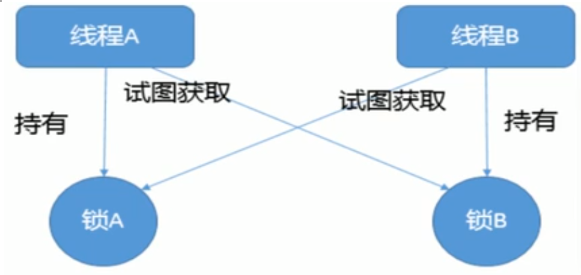

死锁指两个或两个以上的进程在执行过程中, 因争夺资源而造成的一种***互相等待的现象***

产生原因: ① 系统资源不足 ② 进程运行推进的顺序不当 ③ 资源分配不当

解决:

① 通过 jps -l 查看进程号

② jstack  进程号 查看具体代码

##jvm篇

**jvm 初始 deap 最小内存为 1/64, 最大内存为 1/4** 

##### jvm 参数类型

​	**标配参数**: 在jdk各个版本之间稳定, 很少有大变化

​		-version, -help,  -showversion

​	**X 参数**

​		-Xint 解释执行  -Xcomp 第一次使用就编译成本地代码    -Xmixed 混合模式,先编译后执行

​	**XX 参数**

​		① Boolean 类型 

​			-XX: + 或者 - 某个属性值; + 表示开启相应属性特性, - 表示关闭相应属性特性

​			jinfo -flag  参数名 进程编号 ==>   jinfo -flag PrintGCDetails 12184

​		② k v 设置类型

​			-XX:参数名=值  ====> -xx:MetaSpaceSize=64m  设定元空间大小

**查看一个正在运行的 java 程序某个 jvm 参数是否开启, 对应的值是什么**

jinfo -flag 参数名 进程号

​	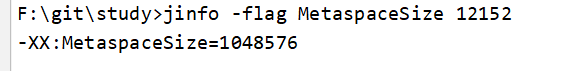

​		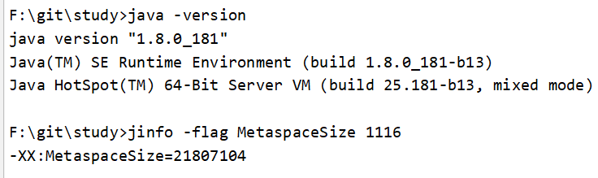

jinfo -flags 进程号   查看当前 jvm 所有生效的参数以及参数值

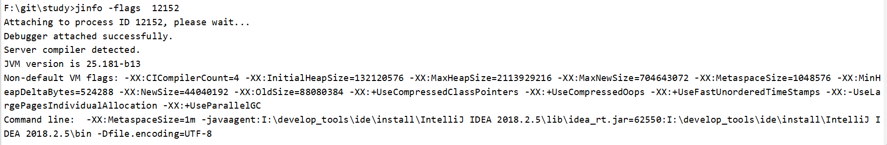

-Xms =-XX:InitialHeapSize    -Xmx = -XX:MaxHeapSize

**查看jvm初始化参数**

java -XX:+PrintFlagsInitial

**查看 jvm 修改更新后参数值**

java -XX:+PrintFlagsFinal -version

对于其中 = 和 := ; = 表示 jvm 初始值, := 表示 jvm 加载后修改或用户修改后的值

**查看 jvm 命令行标记**

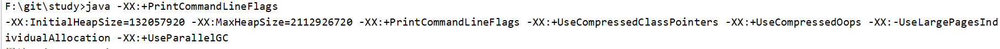

**jvm 常用参数设置**

-Xms: -XX:InitialHeapSize  初始化最小堆内存(物理内存十六分之一)

-Xmx: -XX:MaxHeapSize  最大堆内存(物理内存四分之一)

-Xss: -XX:ThreadStackSize 设置单个线程栈大小, 一般默认为 512~1024k(默认大小依赖平台)

-Xmn 设置年轻代大小(默认堆得三分之一, 老年代三分之二)

-XX:PrintCommandLineFlags: 在命令行打印配置的参数

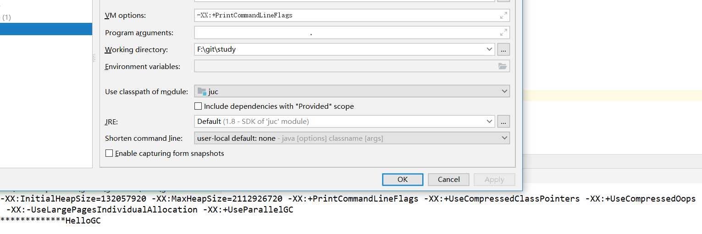

-xx:PrintGCDetail: 打印详细 GC 收集日志信息

GC 收集日志信息

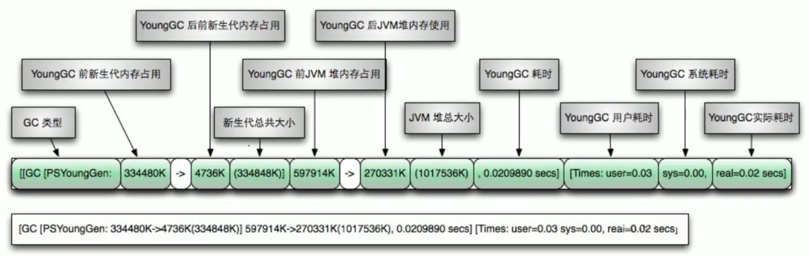

FULL GC 收集日志

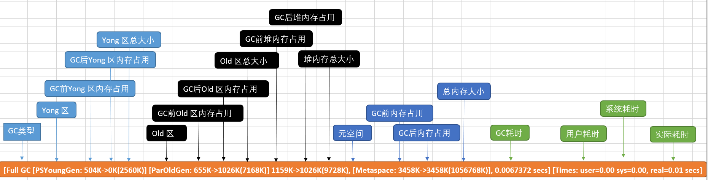

-XX:SurvivorRatio

​	默认 -XX:SURvivorRatio=8, Eden:S0:S1 = 8:1:1

​	SurvivorRatio 值是设置 Eden 区的比列, S0, S1 一样	

-XX:NewRatio

​	默认: -XX:NewRatio=2; old 占 2, young 占1

​	配置新生代和老年代占比;

-XX:MaxTenuringThreshold

​	设置对象在年轻代存在的次数, 默认 15, 如果为 0 , 则年轻代对象不经过 Surviror 区直接进入老年代

**java 引用**

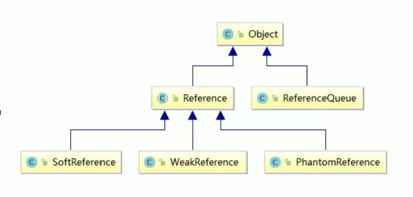

Reference(强引用): 把一个对象赋给一个引用变量, 这个引用变量就是强引用; 对于强引用对象, ***就算 jvm 出现 oom 也不会对该对象进行回收; 即使该对象以后永远都不会被用到***;

```java
Object a = new Object(); // a 就是强引用
Object b = a; // b 也是强引用
a = null; // 即使 a 为null, b 还是只向了 new Object(), b 还为2强引用
System.gc(); // 只会回收 a
```

SoftReference(软引用): 对于软引用指向的对象, 当内存足够时不会回收, 当内存不足时, 会对其进行回收

​	**当内存不够使用时**

```java
	/**
     * @Author yangyun
     * @Description: 内存够用就保留, 不够就回收
     * @Date 2019/8/19 21:17
     * @Param []
     * @returnm void
     **/
    public static void softRefMemoryEnough (){
        Object o = new Object();
        SoftReference<Object> sf = new SoftReference<>(o);
        System.out.println(o);
        System.out.println(sf.get());
        o = null;
        System.gc();
        /**
         * 内存足够的情况
         * java.lang.Object@27d6c5e0
         * java.lang.Object@27d6c5e0
         * null
         * java.lang.Object@27d6c5e0
         **/
        System.out.println(o); // 此时系统内存足够, o null
        System.out.println(sf.get()); // sf 为的值不为 null
    }

	public static void softRefMemoryNotEnough (){
        Object o = new Object();
        SoftReference<Object> sf = new SoftReference<>(o);
        System.out.println(o);
        System.out.println(sf.get());
        o = null;

        try {
            byte b[] = new byte[30 * 1024 * 1024];
        } catch (Throwable t) {

        } finally {
            System.out.println(o);
            System.out.println(sf.get());
        }
    }

    public static void main(String[] args) {
//        softRefMemoryEnough();
        softRefMemoryNotEnough();
    }
```

```xml-dtd
### 运行程序可以看到打印信息
① 内存足够时
[GC (Allocation Failure) [PSYoungGen: 1024K->504K(1536K)] 1024K->664K(5632K), 0.0007805 secs] [Times: user=0.00 sys=0.00, real=0.00 secs] 
[GC (Allocation Failure) [PSYoungGen: 1528K->504K(1536K)] 1688K->981K(5632K), 0.0009326 secs] [Times: user=0.13 sys=0.02, real=0.00 secs] 
[GC (Allocation Failure) [PSYoungGen: 1528K->504K(1536K)] 2005K->1133K(5632K), 0.0006664 secs] [Times: user=0.00 sys=0.00, real=0.00 secs] 
java.lang.Object@27d6c5e0
java.lang.Object@27d6c5e0
[GC (System.gc()) [PSYoungGen: 562K->504K(1536K)] 1191K->1229K(5632K), 0.0005788 secs] [Times: user=0.00 sys=0.00, real=0.00 secs] 
[Full GC (System.gc()) [PSYoungGen: 504K->0K(1536K)] [ParOldGen: 725K->893K(4096K)] 1229K->893K(5632K), [Metaspace: 3459K->3459K(1056768K)], 0.0067961 secs] [Times: user=0.03 sys=0.00, real=0.01 secs] 
null
// 因为内存足够所以软引用引用的对象还存在 
java.lang.Object@27d6c5e0
Heap
 PSYoungGen      total 1536K, used 49K [0x00000000ffe00000, 0x0000000100000000, 0x0000000100000000)
  eden space 1024K, 4% used [0x00000000ffe00000,0x00000000ffe0c698,0x00000000fff00000)
  from space 512K, 0% used [0x00000000fff80000,0x00000000fff80000,0x0000000100000000)
  to   space 512K, 0% used [0x00000000fff00000,0x00000000fff00000,0x00000000fff80000)
 ParOldGen       total 4096K, used 893K [0x00000000ffa00000, 0x00000000ffe00000, 0x00000000ffe00000)
  object space 4096K, 21% used [0x00000000ffa00000,0x00000000ffadf5a8,0x00000000ffe00000)
 Metaspace       used 3465K, capacity 4496K, committed 4864K, reserved 1056768K
  class space    used 376K, capacity 388K, committed 512K, reserved 1048576K
            
② 内存不够
[GC (Allocation Failure) [PSYoungGen: 1024K->504K(1536K)] 1024K->704K(5632K), 0.0007722 secs] [Times: user=0.00 sys=0.00, real=0.00 secs] 
[GC (Allocation Failure) [PSYoungGen: 1528K->504K(1536K)] 1728K->1038K(5632K), 0.0010458 secs] [Times: user=0.00 sys=0.00, real=0.00 secs] 
[GC (Allocation Failure) [PSYoungGen: 1528K->512K(1536K)] 2062K->1291K(5632K), 0.0007314 secs] [Times: user=0.00 sys=0.00, real=0.00 secs] 
java.lang.Object@27d6c5e0
java.lang.Object@27d6c5e0
[GC (Allocation Failure) [PSYoungGen: 598K->512K(1536K)] 1377K->1347K(5632K), 0.0006289 secs] [Times: user=0.00 sys=0.00, real=0.00 secs] 
[GC (Allocation Failure) [PSYoungGen: 512K->512K(1536K)] 1347K->1387K(5632K), 0.0008403 secs] [Times: user=0.00 sys=0.00, real=0.00 secs] 
[Full GC (Allocation Failure) [PSYoungGen: 512K->0K(1536K)] [ParOldGen: 875K->1009K(4096K)] 1387K->1009K(5632K), [Metaspace: 3459K->3459K(1056768K)], 0.0070479 secs] [Times: user=0.02 sys=0.00, real=0.01 secs] 
[GC (Allocation Failure) [PSYoungGen: 0K->0K(1536K)] 1009K->1009K(5632K), 0.0005101 secs] [Times: user=0.00 sys=0.00, real=0.00 secs] 
[Full GC (Allocation Failure) [PSYoungGen: 0K->0K(1536K)] [ParOldGen: 1009K->990K(4096K)] 1009K->990K(5632K), [Metaspace: 3459K->3459K(1056768K)], 0.0064761 secs] [Times: user=0.00 sys=0.00, real=0.01 secs] 
// 因为内存不够, 所以被回收了
null
null
Heap
 PSYoungGen      total 1536K, used 31K [0x00000000ffe00000, 0x0000000100000000, 0x0000000100000000)
  eden space 1024K, 3% used [0x00000000ffe00000,0x00000000ffe07d28,0x00000000fff00000)
  from space 512K, 0% used [0x00000000fff80000,0x00000000fff80000,0x0000000100000000)
  to   space 512K, 0% used [0x00000000fff00000,0x00000000fff00000,0x00000000fff80000)
 ParOldGen       total 4096K, used 990K [0x00000000ffa00000, 0x00000000ffe00000, 0x00000000ffe00000)
  object space 4096K, 24% used [0x00000000ffa00000,0x00000000ffaf7a70,0x00000000ffe00000)
 Metaspace       used 3466K, capacity 4496K, committed 4864K, reserved 1056768K
  class space    used 376K, capacity 388K, committed 512K, reserved 1048576K
```

WeakReference(弱引用): 在执行 gc 的时候, 不管内存是否够用都会被回收

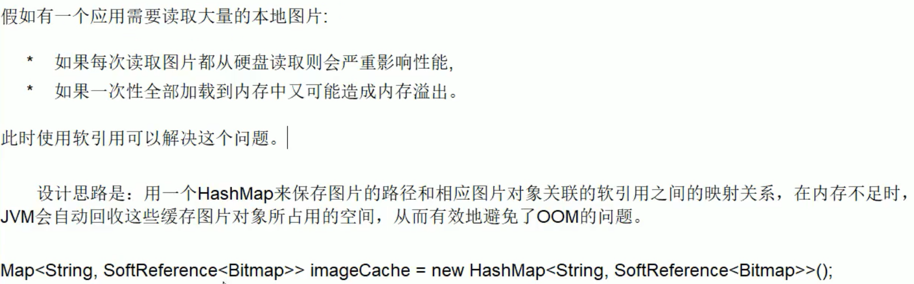

PhantomReference(虚引用): 任何时候都可以被 jvm 护回收, 不能单独使用, 也不能通过它访问对象, 并且只能和引用队列(ReferenceQueue)联合使用; 

主要作用是跟踪对象被垃圾回收的状态, 仅仅提供了一种确保对象呗 finalize 以后, 做某些事情的机制

**ReferenceQueue**: 引用队列

当引用队列和引用结合使用时,  当 GC 释放内存的时候, 对将引用放入到 ReferenceQueue 中, 意味着引用指向的堆内存中的对象被回收. 通过这种方式, 我们可以在对象被回收做一些后续操作

###OOM

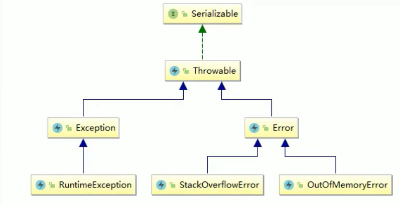

#####java.lang.StackOverflowError:** 栈溢出, 由于方法深度调用(递归)

#####java.lang.OutOfMemoryError:** java heap space  java 堆溢出, 内存中对象超出最大堆大小导致

#####java.lang.OutOfMemoryError:** GC overhead limit exceeded

​	[参考资料](https://blog.csdn.net/renfufei/article/details/77585294)

​	因为 GG 为了释放较小的空间而占用了 98% 的时间, 也就是回收了 2% 使用 98% 的时间, 然后多次重复这个操作;

​	一般因为堆内存设置较小, 或者程序有大量对象创建却没有被回收

#####java.lang.OutOfMemoryError:** Direct buffer memory

​	写 NIO 程序经常使用 ByteBuffer 来读取或写入数据, 这是一种基于通道 (channel) 和缓冲区(Buffer) 的 I/O 操作, 它可以使用 Native 函数库直接分配内存, 然后通过一个存储在 java 堆里面的 DirectByteBuffer 对象作为这块内存的引用进行操作, 这样能显著提高性能, 因为避免了在 java 堆和 Native 堆中来回复制数据

​	ByteBuffer.allocate(capability) 是直接在 jvm 中分配内存, 属于 GC 管辖, 由于需要拷贝数据, 所以速度相对较慢

​	ByteVBuffer.allocateDirect(capability) 是分配 os 本地内存(系统物理内存), 不属于 gc 管辖, 由于不需要内存拷贝所以速度较快

​	如果在进行大量 I/O 操作的时候, 由于堆内存使用较少 gc 基本不会执行, 而本地内存在持续使用, 当本地内存不够使用的时候就会抛出: 本地 OutOfMemoryError 错误

#####java.lang.OutOfMemoryError:** unable to create new native thread

​	为何是 native thread?

```java
	public static void main(String[] args) {
        Thread t = new Thread();
        t.start();
    }
// 类 Thread 源码
	public synchronized void start() {
        /**
         * This method is not invoked for the main method thread or "system"
         * group threads created/set up by the VM. Any new functionality added
         * to this method in the future may have to also be added to the VM.
         *
         * A zero status value corresponds to state "NEW".
         */
        if (threadStatus != 0)
            throw new IllegalThreadStateException();

        /* Notify the group that this thread is about to be started
         * so that it can be added to the group's list of threads
         * and the group's unstarted count can be decremented. */
        group.add(this);

        boolean started = false;
        try {
            start0(); // 该方法为本地方法
            started = true;
        } finally {
            try {
                if (!started) {
                    group.threadStartFailed(this);
                }
            } catch (Throwable ignore) {
                /* do nothing. If start0 threw a Throwable then
                  it will be passed up the call stack */
            }
        }
    }
  	private native void start0();
```

​	高并发请求服务器时, 经常出现该错误

​	导致原因

​		应用创建了太多线程, 超过系统承载极限

```shell
# 查看 root 用户单个进程线程数上限
[root@iZwz94664y88uglloijjy9Z ~]# ulimit -u
7284
# 查看限制文件中配置的参数
# 在 /etc/security/limits.d/?--nproc.conf  ? 在不同的 Linux 系统中所表示的数字不同, centos 7.2 64X
[root@iZwz94664y88uglloijjy9Z ~]# 
[root@iZwz94664y88uglloijjy9Z limits.d]# cat 20-nproc.conf 
# Default limit for number of user's processes to prevent
# accidental fork bombs.
# See rhbz #432903 for reasoning.
*          soft    nproc     4096 /# 普通用户
root       soft    nproc     unlimited # root用户
```

​		服务器不允许应用程序创建这么多线程, Linux 系统默认允许单个进程可以创建线程数是1024 个

​	解决方法

​		分析应用程序是否真的需要创建这么多线程, 降低应用程序的线程数量

​		如果需要创建很多线程, 可以通过修改 linux 系统默认配置, 扩大默认线程数

#####java.lang.OutOfMemoryError:** Metaspace

​	jdk 8 中 元空间替代了永久代; 元空间不在虚拟机内存中, 而是使用本地内存

​	元空间中保存的信息:

​		① 虚拟机加载的类信息(rt.jar 中 String.class, ArrayList.class..) ② 常量池 ③ 静态变量 ④ 即时编译后的代码

```shell
java version "1.8.0_181"
Java(TM) SE Runtime Environment (build 1.8.0_181-b13)
Java HotSpot(TM) 64-Bit Server VM (build 25.181-b13, mixed mode)
```

**在这个版本中 -XX:MetaspaceSize 和 -XX:MaxMetaspaceSize 的大小不能相同**

```shell
# -XX:MetaspaceSize=8m -XX:MaxMetaspaceSize=8m, 报错
Error occurred during initialization of VM
MaxMetaspaceSize is too small.
```

#### 垃圾回收

##### 垃圾回收算法

引用计数, 复制拷贝, 标记清除, 标记整理

##### 垃圾回收方式

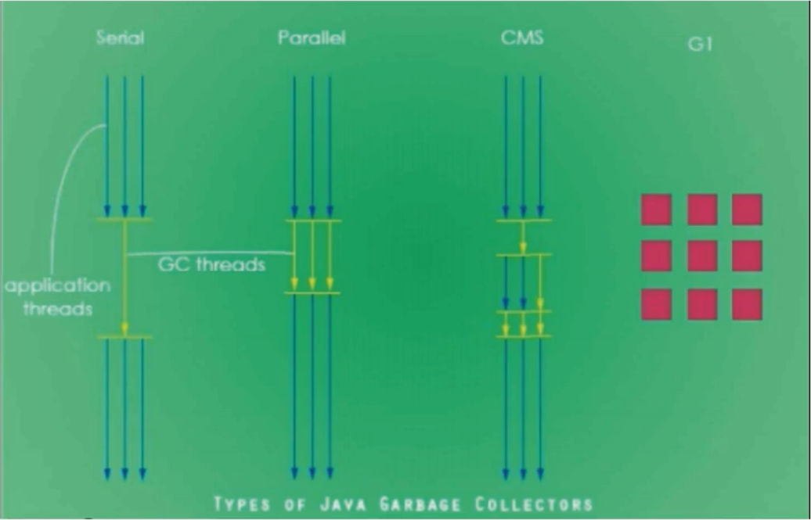

Serial: 串行, 为单线程环境设计且只有一个线程进行回收, 会暂停所有用户线程, 不适合服务器环境使用

Parallel: 并行, 多个垃圾收集器并行工作, 此时用户线程是暂停的, 适应于科学计算/大数据处理等弱交互式应用

CMS: 并发标记, 用户线程和垃圾收集器同时执行(不一定并行, 可能交替执行), 不需要暂停用户线程, 互联网公司多用, 适用堆相应时间有要求的场景

G1: 将堆内存分割成不同的区域然后并发的对其进行回收

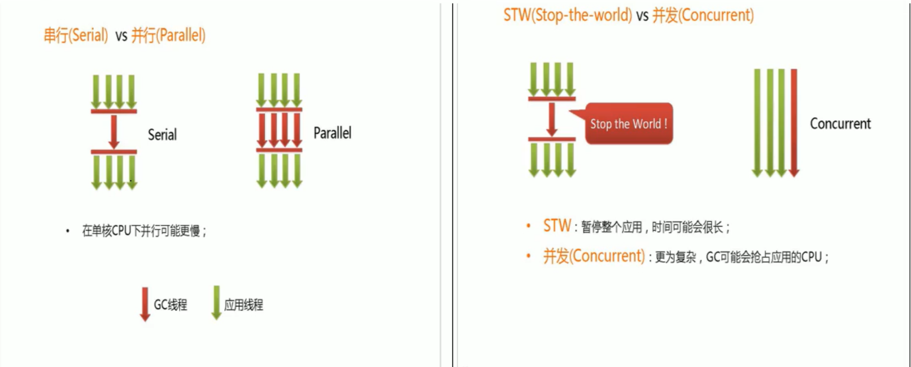

查看默认使用垃圾收集器: java -XX:+PrintCommandLineFlags -version

```shell
F:\git\study>java -XX:+PrintCommandLineFlags -version
-XX:InitialHeapSize=132057920 -XX:MaxHeapSize=2112926720 -XX:+PrintCommandLineFlags -XX:+UseCompressedClassPointers -XX:+UseCompressedOops -XX:-UseLargePagesInd
ividualAllocation -XX:+UseParallelGC
java version "1.8.0_181"
Java(TM) SE Runtime Environment (build 1.8.0_181-b13)
Java HotSpot(TM) 64-Bit Server VM (build 25.181-b13, mixed mode)
```

java GC 回收的类型主要有:

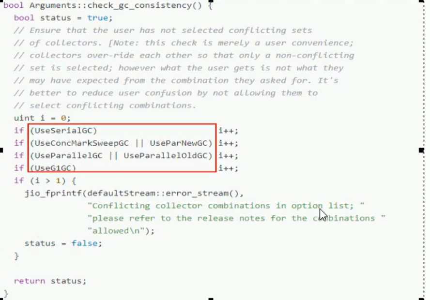

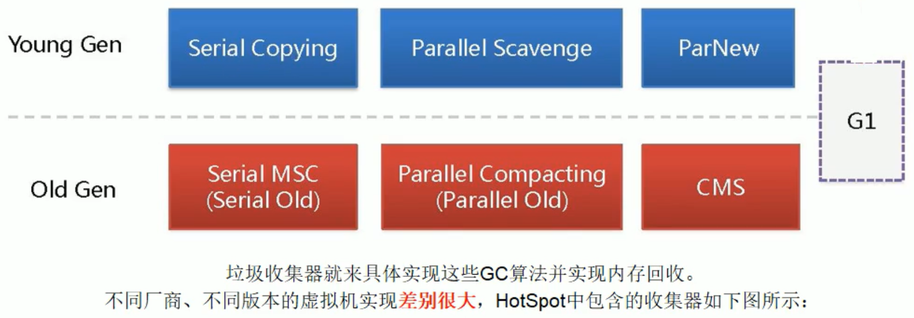

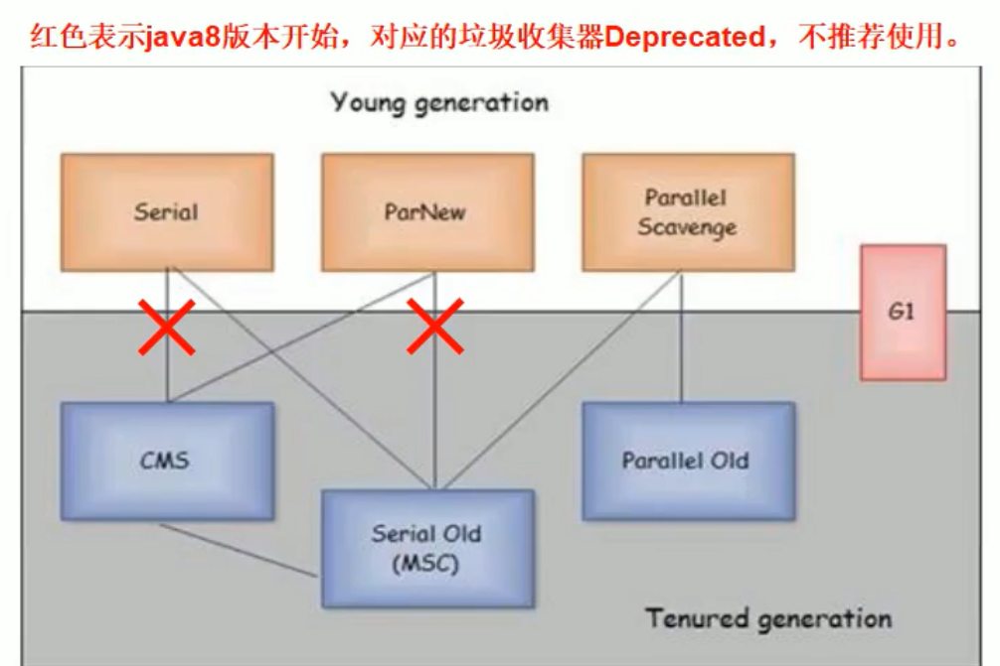


UseSerialGC, UseParallelGC, UseConcMarkSweepGC, UseParNewGC, UseParallelOldGC, UseG1GC

DefNew: Default New Genaration

Tenured: old

parNew: Parallel New Generation

PSYoungGen:Parallel Scavenge

ParOldGen: Parallet Old Generation

#####新生代

串行 GC : Serial/Serial Copying

一个单线程收集器, 在进行垃圾回收的时候, 必须暂停其他所有的工作线程直到它收集结束

串行收集器是最古老最稳定以及高效的收集器, 只使用一个线程去回收, 但其在进行垃圾回收的时候可能会产生较长的停顿(Stop The world), 虽然需要暂停其他工作线程, 但是它简单高效, 对于限定单个 CUP 环境, **没有线程交互的开销可以获得最高效的单线程垃圾收集, 因此 Serial 依然是 java 虚拟机运行在 Client 模式下默认的新生代垃圾收集器**

对应 JVM 参数: -XX:+UseSerialGC

开启后会使用: Serial(Young 使用) + Serial Old (Old 区使用)的收集器组合

表示: 新生代, 老年代都会使用串行回收收集器, 新生代使用复制算法, 老年代使用复制-整理算法

例: -Xms10m -Xmx10m -XX:+PrintGCDetails -XX:+UseSerialGC 

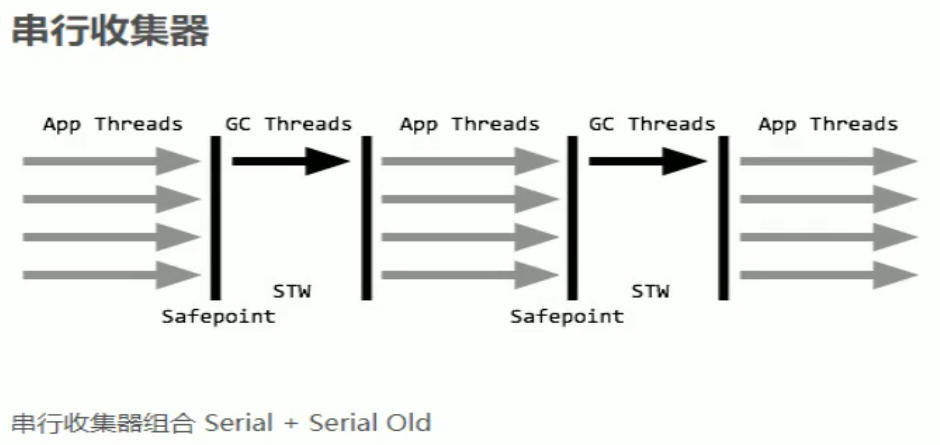

② 并行 GC : ParNew

使用多线程进行垃圾回收, 在进行垃圾回收的时候, 会 STW 所有工作线程直到垃圾回收结束

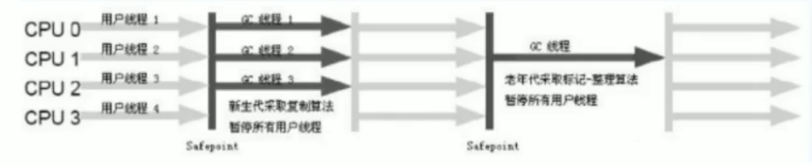

ParNew 收集器其实就是 Serial 收集器新生代的并行多线程版本, 最常见的场景就是结合 CMS GC 工作, 其余的行为和 Serial 完全一样. **它是很多 java 虚拟机运行在 Sever 模式下新生代的默认垃圾收集器**

常见对应 jvm 参数: -XX:+UseParNewGC, 启用 ParNew 只会影响新生代, 不影响老年代

开启后会使用: SerialNew(Young 使用) + Serial Old (Old 区使用)的收集器组合, 新生代使用复制算法, 老年代使用标记-整理算法

但是, ParNew + Tenured 这样的搭配在 java 8 中已经不推荐使用

-XX:ParallelGCThreads 限制线程数量, 默认和 CPU 数量一样; 

-XX:ParallelGCThreads=N, CPU>8 N = 5/8, CPU<8 N=实际 cpu 个数

③ 并行回收 GC: Parallel / Parallel Scavenge

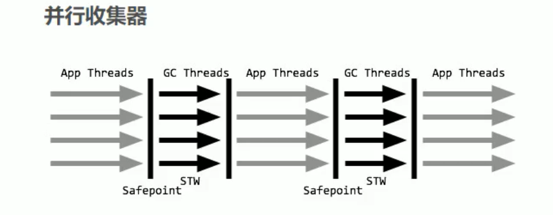

Parallel Scavenge 收集器类似 ParNew 也是一个新生代垃圾收集器, 使用复制算法, 也是一个并行多线程的垃圾收集器, 俗称吞吐量优先收集器. 也就是说: 串行收集器在新生代和老年代的并行化

**它关注的重点:**

**可控制的吞吐量**(Thoughput = 运行用户代码时间/(运行用户代码时间 + 垃圾回收时间), 也就是说, 程序运行100分分钟, 垃圾收集 1分钟, 吞吐量就是 99%), 高吞吐量意味着高效利用 cpu 的时间, 它多用于在后台运算而不需要太多交互的任务.

**自适应调节策略也是 ParallelScavenge 收集器于 ParNew 收集器一个重要的区别.** (自适应调节策略: 虚拟机会根据当前系统的运行情况收集性能监控信息, 动态调整这些参数以提供最合适的停顿时间(-XX:MaxGCPauseMillis) 或最大吞吐量)

常用 jvm 参数: -XX:+UseParallelGC 或 -XX:+UseParallelOldGC(可相互激活)

使用 ParallelScavenge 收集器, 开启参数以后, 新生代使用复制算法, 老年代使用标记-整理算法

##### 老年代

######并行

 Parallel Old 收集器是 Parallel Scavenge 的老年代版本, 使用多线程的标记-征集算法, Parallel Old 收集器在 JDK1.6 才开始提供. 在 JDK1.6 以前, 新生代使用 ParallelScavenge 收集器只能搭配老年代的 Serial Old 收集器, 只能保证新生代的吞吐量, 无法保证整体的吞吐量. 在 JDK1.6 之前 (Parallel Scavenge + Serial Old)

Parallel Old 正式为了在老年代同样提供吞吐量优先的垃圾收集器, 如果系统对吞吐量的要求比较高, JDK1.8 后可以优先考虑新生代 Paralllel Scavenge 和老年代 Parallel Old 收集器的搭配策略. 在JDK1.8 及以后(Parallel Scavenge + Parallel Old)

JVM 常用参数: 

-XX:+UseParallelOldGC 使用 Parallel Old 收集齐全, 设置该参数后, 新生代默认使用 Parallel Scavenge

###### 并发标记清除GC(CMS)

CMS 收集器(Concurrent Mark Sweep: 并发标记清除) **是一种以后去最短回收停顿时间为目标的收集器**

适合应用在互联网站或者 B/S 系统的服务器上, 这类应用尤其重视服务器的响应速度, **希望系统停顿时间最短**

CMS 非常适合堆内存大, CPU 核数多的服务器端应用, 也是 G1 出现之前大型应用的首选垃圾收集器

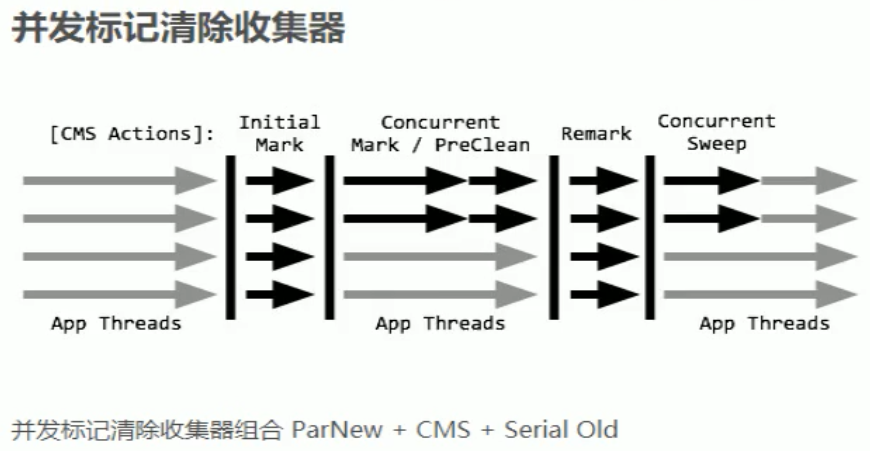

① Initial Mark: 初始标记 只是标记一下 GC Roots 能直接关联的对象, 速度很快, 但还是需要暂停所有的工作线程

②CMS Concurrent Mark: 并发标记和用户线程一起, 进行 GC Roots 跟踪的过程, 和用户线程一起工作, 不需要暂停工作线程. 主要标记过程, 标记全部对象

③重新标记 CMS Remark 为了修正咋并发标记期间, 因用户程序继续运行而导致标记产生变动的那一部分对象的标记记录, 仍然需要暂停所有的工作线程. 由于并发标记时, 用户线程依然运行, 因此在正式清理前, 再做修正

④并发清除 CMS Concurrent Sweep 和用户线程一起  清除 GC Roots 不可达对象, 和用户线程一起工作, 不需要暂停工作线程, 基于标记结果, 直接清理对象. 由于耗时最长的并发标记和并发清除过程中, 垃圾收集线程可以和用户线程一起并发工作, 所以总体上来看 CMS 收集器的内存回收和用户线程是一起并发执行的

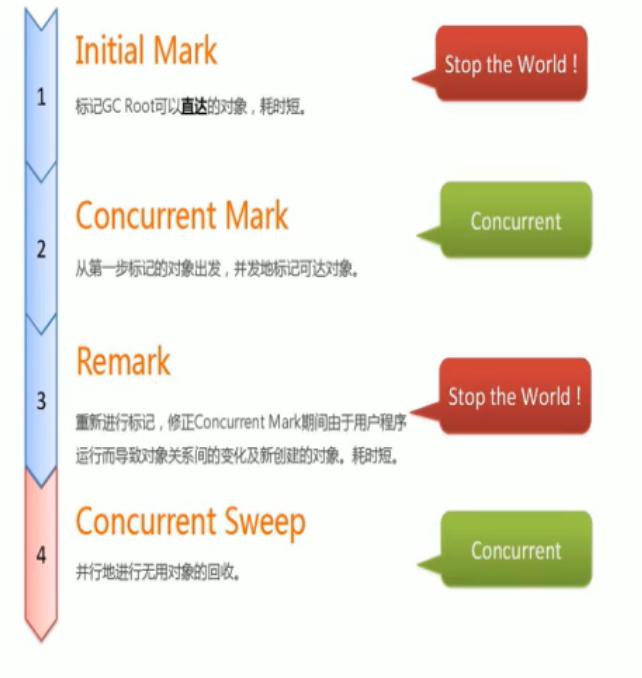

优点: 并发收集停顿低; 

缺点:

① 并发执行对 cpu 的压力比较大

由于并发执行, CMS 在收集与应用线程会同时增加对堆内存的占用, **也即是说, CMS 必须要在老年代堆内存用尽之前完成垃圾回收, 否则 CMS 回收失败时,** 将触发担保机制, 串行老年代收集器将会以 STW 的方式进行一次 GC, 从而造成较大停顿时间

② 采用并发标记清除算法会导致大量内存碎片 

标记清除算法无法整理空间碎片, 老年代空间会随着应用时长逐步耗尽, 最后不得不通过担保机制对堆内存进行压缩. CMS 也提供了参数 -XX:CMSFullGCsBeForeCompaction(默认 0, 即每次进行内存整理) 来制定多少次 CMS 收集之后, 进行一次压缩的 Full GC

Concurrent Mark Sweep 并发标记清除, 并发收集低停顿, **并发指的是与用户线程一起执行**

开始启收集器的 JVM 参数: -XX:+UseConcMarkSweepGC 开启该参数后会自动将 -XX:+UseParNewGC 打开

开启参数后, 使用 ParNew(Young 使用) + CMS (Old 使用) + Serial Old 的收集器组合, **Serial Old 将作为CMS 出错的后备收集器**

-Xms10m -Xmx10m -XX:+PrintGCDetails -XX:+UseConcMarkSweepGC

底层代码: 

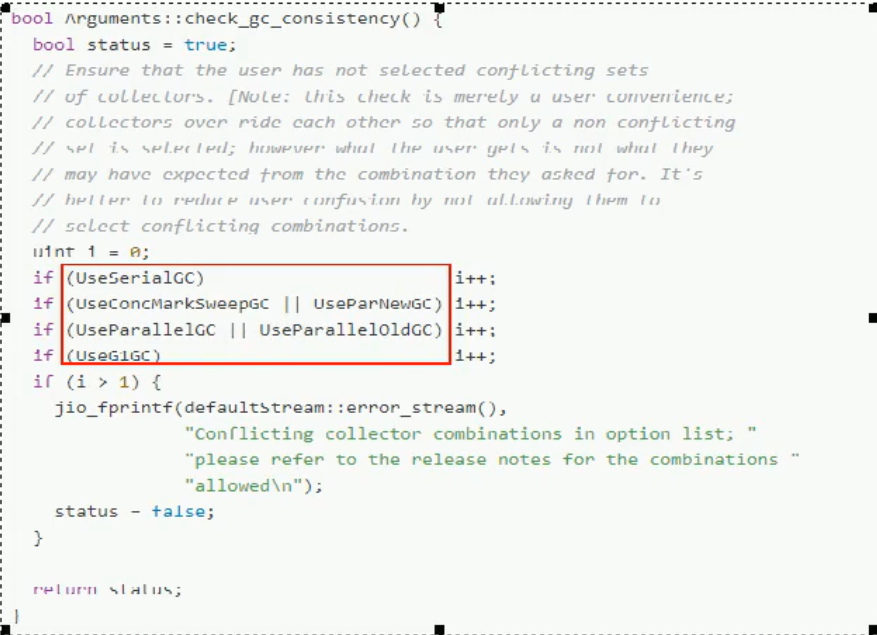

##### 如何选择垃圾收集器

单 CPU 或小内存, 单机程序

​	-XX:+UseSerialGC

多 CPU , 需要做大吞吐量, 如后台计算型应用

​	-XX:+UseParallelGC 或者 -XX:UseParallelOldGC

多 CPU, 追求低停顿时间, 需要最快响应速度, 如互联网应用

​	-XX:+UseConcMarkSweepGC

​	-XX:+UseParNewGC

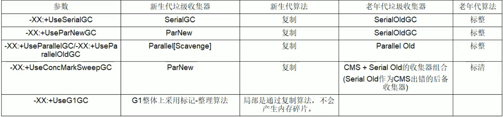

##### G1 GC

###### 以前收集器的特点

① 年轻代和老年代是各自独立且连续的内存块

② 年轻代收集使用单 eden + s0 + s1 进行复制算法

③ 老年代收集必须扫描整个老年代区域

④ 都是以尽可能少而快速地执行 GC 为设计原则

###### 什么是G1

G1 (Garbage-First) 收集器, 是一款面向服务端应用的收集器

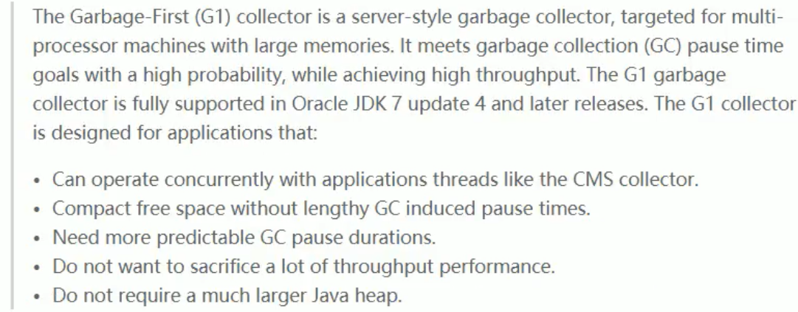

从官网的描述中, 我们知道 G1 是一种服务端的垃圾手哦哦及其, 应用在多处理器和大容量内存环境中, 在实现高吞吐量的同时, 尽可能的满足垃圾收集暂停时间的要求, 另外, 它还具有以下特征: 

① 像 CMS 收集器一样, 能与应用程序线程并发执行

②  整理空闲空间更快

③ 需要更多的时间来预测 GC 停顿时间

④ 不希望牺牲大量的吞吐性能

⑤ 不需要更大的 java heap

G1 收集器的**设计目标是取代 CMS 收集器**, 它同 CMS 相比, 在以下方面更出色

① G1 是一个有整理内存过程的垃圾收集器, 不会产生很多内存碎片

② G1 的 Stop The World 更可控, G1 在停顿时间上添加了预测机制, 用户可以指定期望停顿时间

CMS 垃圾收集器虽然减少了暂停应用程序的运行时间, 但是它还是存在着内存碎片问题. 于是, 为了取出内存碎片问题, 同时又保留 CMS 垃圾收集器低暂停时间的优点, JAVA7 发布了一个新的垃圾是搜集器 - G1 垃圾收集器

G1 是在 2012年才在 jdk 1.7u4 中可用. **Oracle 官方计划在 jdk 9 中将 G1 变成默认的垃圾收集器以替代 CMS.** 它是一款面向服务端应用的收集器, 主要应用在多 CPU 和大内存服务器环境下, 极大的减少垃圾收集的停顿时间, 全面提升服务器的性能, 逐步替换 java8 以前的 CMS 收集器

G1 相比以前的收集器, 主要改变是 Eden, Survivor 和 Tenured 等内存区域不在是连续的, 而是变成了一个个大小一样的 region, 每个 region 从 1M 到 32M 不等, 一个 region 有可能属于 Eden,Survivor 或者 Tenured 内存区域

###### G1 特点

① G1 能充分利用多 cpu, 多核环境硬件优势, 尽量缩短 STW

② G1 整体上采用标记-整理算法, 局部是用过复制算法, **不会产生内存碎片**

③ 宏观上看 G1 之中不在区分年轻代和老年代. **把内存划分成多个独立的子区域(Region)** 

④ G1 收集器粒粒面将真个的内存区域都混合在一起, **但其本身依然在小范围内要进行年轻代和老年代的区分,** 保留了新生代和老年代, 但他们不再试物理隔离的, 而是一部分 Region 的集合且不需要 Region 是连续的, 也就是说依然会采用不同的 GC 方式来处理不同的区域

⑤ G1 虽然也是分代收集器但整个内存区分不存在物理上的年轻代和老年代的区别, 也不需要完全独立的 Survivor(to space) 堆做复制准备. G1 只有逻辑上的分代概念, 或者说每个分区都可能随 G1 的运行在不同代之间前后切换

###### G1 底层原理

**Region 区域化垃圾收集器**

区域化内存划片 Region, 整体变为了一系列不连续的内存区域, 避免了全内存的 GC 操作.

核心思想是将真个堆 内存区域分成大小相同的子区域(Region), 在 JVM 启动时会自动设置这些子区域的大小,  在堆得使用上, **G1 并不要求对象的存储一定是物理上连续的只要逻辑上连续即可,** 每个分区也不会固定的为某个代服务, 可以按需在年轻代和老年大之间切换,. 启动时可以通过参数 -XX:G1HeapRegionSize=n 制定分区大小(1MB-32MB, 且是 2 的幂), 默认将整堆划分为 2048 个分区.

大小范围在1MB-32MB, 最多设置20448个分区, 也就是最大能支持的内存大小: 32MB * 2048 = 65536MB = 64GB


G1 算法将堆分为偌干个区域(Region), 它仍然属于分代收集器

这些Reion 的一部分包含新生代, 新生代的垃圾收集依然采用暂停所有应用线程的方式, 将存活对象拷贝到老年代或者 Survivor 空间

这些 Region 的一部分包含老年代, G1 收集器通过将对象从一个区域复制到另一个区域完成了清理工作. 这就意味着, 在正常的处理过程中, G1 完成了堆得压缩, (至少是部分堆得压缩), 这样也就不会存在 CMS 内存碎片问题的存在了

在G1 中, 还有一种特殊的区域, Humongous(巨大的) 区域。如果一个巨型对象占用的空间超过的分区容量的50%以上，G1收集器就认为这是一个大对象。这些**巨型对象默认直接会被分配在老年代**，如果它是一个短期存在的大对象，就会对垃圾收集器造成负面影响。为了解决这个问题，G1 划分了一个 Humongous 区，它用来专门存放大对象。如果一个 H 区装不下一个大对象，那么 G1会寻找连续的 H 区来存储。为了能找到连续的 H 区，有时候不得不启动 Full GC

**回收步骤**

G1收集器下的Young GC

针对 Eden区进行收集，Eden区耗尽后会被触发，主要是小区域收集 + 形成连续的内存块，避免内存碎片

① Eden区的数据移动到 Survivor区，假如出现Survivor区空间不够，Eden区数据会部分晋升到Old区

② Survivor区的数据移动到新的Survivor区，部分数据晋升到Old区

③ 最后Eden区收拾干净了，GC结束，用户的应用程序继续执行


**收集步骤**

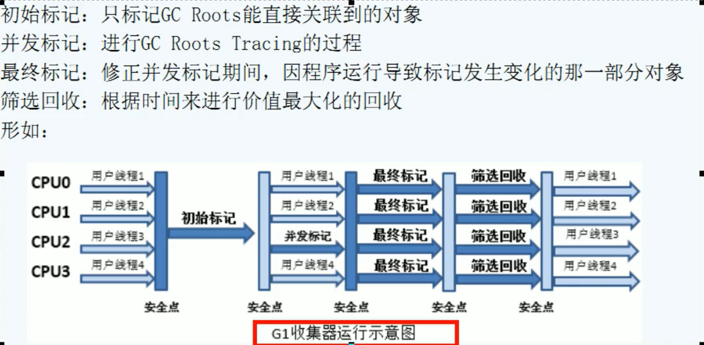

**常用配置参数**

-XX:+UseG1GC

-XX:G1HeapRegionSize=n 设置Region大小, 总大小为 你* 2048

-XX:+MaxGCPauseMillis=n 最大GC停顿时间, 是个软目标, jvm 尽可能(不一定完成), 在规定时间内完成回收

-XX:InitiatingHeapOccupancyPercent=n 堆占用多少时就触发GC, 默认 45

-XX:ConcGCThreads=n 并发GC使用线程数

-XX:G1ReservePercent=n 设置作为空闲空间的预留内存百分比, 降低目标空间溢出的粉线, 默认 10%

**java -server jvm参数 -jar xxx.jar**


