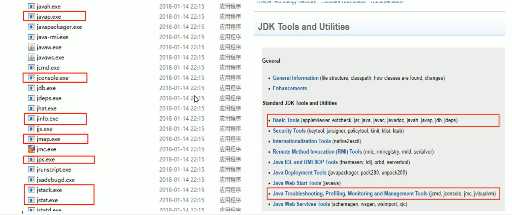

## liunx 查看命令

###查看整机系统性能

top : 查看 cpu 内存使用情况

uptime： top 精简版

.jpg)

load average: 0.01, 0.02, 0.05 系统负载均衡; 三个值分别代表了系统的平均负载值 一分钟，五分钟，十五分钟

如果 （0.01 + 0.02 + 0.05）/ 3 * 100% > 60% 说明系统的压力超重

### cpu查看

vmstat -n 2 3 每两秒查看一次， 一共查看3次

.jpg)

一般 vmstat 工具的使用是通过两个数字参数来完成的，第一个参数是采样的时间间隔数单位是毫秒，第二个参数是采样的总次数

- procs
  - r：运行和等待 cpu 时间片的进程数， 原则上 1核的cpu的运行队列不要超过2，整个系统的运行队列不能超过总核数的2倍
  - b：等待资源的进程数，比如正在等待磁盘 I/O、网络I/O等。
- cpu
  - us：用户进程消耗cpu时间百分比，us值高，用户及昵称消耗cpu时间多，如果长期大于50%，优化程序
  - sy：内核进程消耗的cpu时间百分比
  - us + sy参考值为80%，如果大于80%，说明可能存在cpu不足
  - id：处于空闲的cpu百分比
  - wa：系统等待 IO 的 CPU 时间百分比
  - st：来自于一个虚拟机偷取的 CPU 时间的百分比

mpstat -P ALL 2 查看所有 cpu 核的信息

.jpg)

idle：代表空闲率

每个进程使用cpu的用量分解信息

pidstat -u 1 -p 进程id

### 查看内存使用

.jpg)

**一般使用 free -m 表示根据 MB 来划分**

应用程序可用内存/系统物理内存 > 70% 内存充足

应用程序可用内存/系统物理内存 < 20% 内存不足

**20% < 应用程序可用内存/系统物理内存 < 70% 内存基本够用**

pidstat -p 进程id -r 采样间隔毫秒数: 进程使用内存的详细

### 查看磁盘剩余空间

df -h

### 查看磁盘IO

iostat -sdk 2 3

.jpg)

磁盘块设备分布

rkB/s 每秒读取数据量 kb

wkB/s 每秒写入数据量 kb

svctm I/O 请求的平均服务时间, 单位毫秒

await I/O 请求的平均等待时间, 单位毫秒; 值越小, 性能越好

**util: 一秒钟有百分之几的时间用于 I/O 操作. 接近 100% 时, 表示磁盘带宽跑满, 需要优化程序或者增加磁盘**

rkB/s、wkB/s 根据系统应用不同会有不同的值， 但有规律遵循：长期、超大数据读写，肯定不正常，需要优化程序

svctm 的值与 await 的值很接近，表示几乎没有 I/O 等待， 磁盘性能好

如果await 的值远高于 svctm 的值，则表示 I/O 队列等待太长， 需要悠哈程序或更换更快磁盘

查看详细使用请款

#### pidstat -d 时间间隔 -p 进程编号

.jpg)

### 网络 IO 

ifstat

### 生产环境出现CPU占用过高,排除思路

结合linux和jdk命令分析

① 先用 top 命令查看cpu占比高的应用

② ps -ef 或者 jps 进一步定位, 得知是一个怎样的后台程序

③ 定位到具体的代码

​	ps -ef|grep java|grep -v grep 或者 jps -l 

​	ps -mp 进程 -o THREAD,tid,time

​	-m 显示所有的线程 -p pid 进程使用cpu 的时间  -o  该参数后是用户自定义格式

④ 将需要的线程id转换为16进制格式(英文小写)

​	printf "%x\n" 线程id

⑤ jstack 进程id |grep tid(16进制id小写) -A60

​	根据具体代码查看代码上下文

### 对于jdk 自带的 JVM 监控和性能分析工具

性能监控工具: 

​	https://docs.oracle.com/javase/8/docs/technotess/tools/ 

​	https://docs.oracle.com/javase/8/docs/technotes/tools/unix/toc.html

jps: 虚拟机进程工具

jinfo: java 配置信息工具

jmap: 内存映像工具

​	生成java应用程序的堆快照和对象统计信息

​	映射堆快照: jmap -heap 进程id

​	抓取堆内存

​		生成 hprof 文件并下载到本地

​		MAT 分析插件工具	

jstat: 统计信息工具 

​	可以查看堆内存各部分的使用量, 以及类加载的信息

​	case:

​		类加载信息

​		编译统计

​		垃圾回收统计

jstack: 堆栈异常跟踪工具

jvisualvm: 

jconsole: 

## git 操作

### 常用词

watch: 会持续收到该项目的动态

fork: 复制某个项目到自己的 githup 仓库

star: 点赞

clone: 讲项目下载至本地

follow: 关注你感兴趣的作者, 会收到他们的动态

### in 关键词限制搜索范围

xxx关键词 in:name,readme,description    seckill in:name,readme,description

xxx in:name 项目名包含 xxx

xxx in:readme 项目readme文件中包含 xxx

xxx in:description 项目描述包含 xxx

### stars 或 fork  数量关键词去查找

xxx 关键词 stars 通配符 --> :> 或者 :>=

区间范围数字: 数字1..数字2

查找 stars 大于等于 5000 的springboot 项目: --> springboot stars:>=5000

查找 fork 大于 500 的springcloud 项目: --> springcloud:>500

查找 fork 在 100 到 200 之间, 并且 stars 数在80 到 100 之间的 springboot 项目

​	springboot forks:100..200 stars:80..100

### awesome 加强搜索

一般用来收集学习、工具、书记类相关的项目

awesome redis

### 高亮显示某一行代码

githup 代码地址 + #L数字：高亮显示某行

githup 代码地址 + #L数字1-L数字1：高亮显示数字1到数字2之间的代码

### 项目内搜索

英文t： 项目内搜索

https://help.github.com/en/articles/using-keyboard-shortcuts

###搜索某个地区内的大佬

location:shenzhen language:java